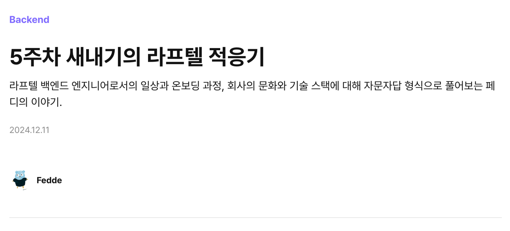
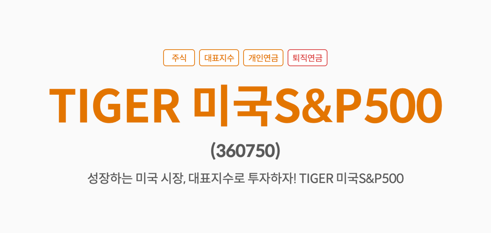
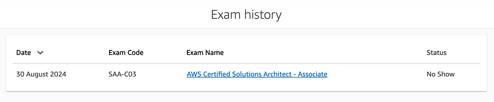
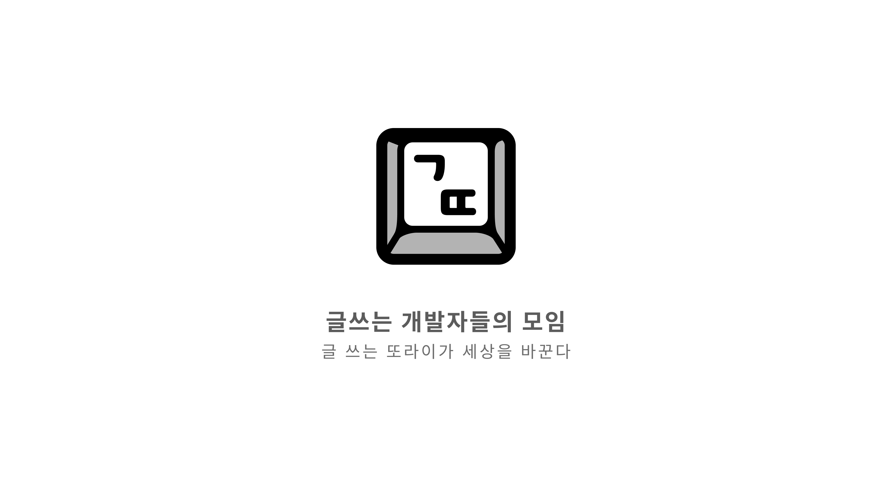
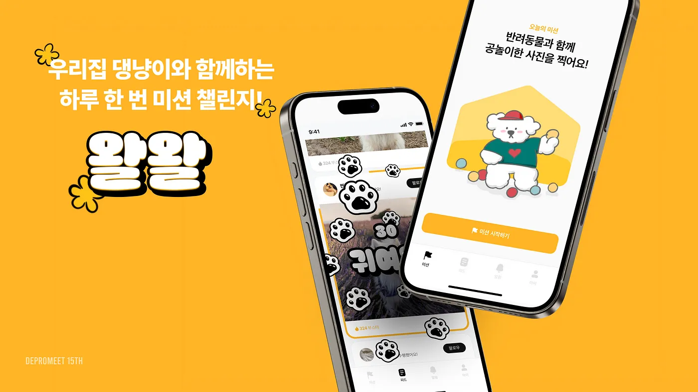
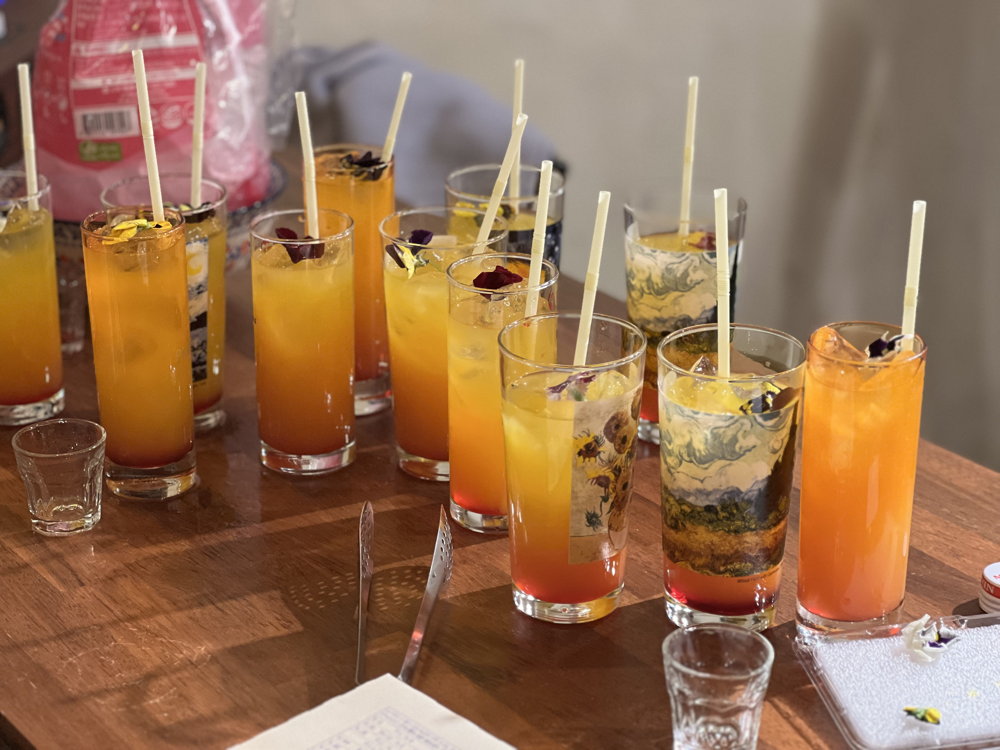

+++
title="2024 회고"
date=2025-01-05 20:00:00
updated=2025-01-05
description="2024년은 나에게 어떤 해였는가?"

[taxonomies]
tags=["회고"]

[extra]
giscus=true
quick_navigation_buttons=true
katex=true
social_media_card="127-0-0-11111-blog-2024-review.jpg"
+++

# 2024년은 나에게 어떤 해였는가?

> 한마디로 요약하자면 “많이 바뀐 해”였던 것 같습니다.

지난 1년 동안 무슨 일이 있었는지 돌아보며 정리해보겠습니다.

---

## 🦖 있었던 일

> 한 해 동안 기억에 남는 세 가지

### 1. 새로운 회사에 합류했어요

애니메이션 OTT 서비스 ‘라프텔’에 백엔드 엔지니어로 합류했습니다.

**느낀 점**: 회사 분위기도 좋고, 일도 너무 재밌습니다. 감사한 마음뿐이네요.

**교훈**: 좋아하는 일을 하자.

---

### 2. 주식으로 벌었어요

ISA 계좌를 새로 만들어, 다른 주식은 일절 사지 않고 아래 두 종목만 샀습니다.

1. [TIGER 미국S&P500](https://www.tigeretf.com/ko/product/search/detail/index.do?ksdFund=KR7360750004) (가장 유명해서)
2. [TIGER 미국테크TOP10타겟커버드콜](https://www.tigeretf.com/ko/product/search/detail/index.do?ksdFund=KR7474220001) (좋아하는 테크 기업들이 많아서)

**느낀 점**: 주식 창을 자주 들여다보지 않으니 마음이 편했습니다.

**교훈**: 재능이 없다고 느껴지면 전문가에게 맡기는 것도 좋은 선택이더군요.

---

### 3. 커피를 끊었어요

원래 커피를 물처럼 마셨는데, 올해 카페인 의존을 끊는 데 성공했습니다.

**느낀 점**: 커피머신은 아쉽지만, 커피 자체는 여전히 좋아서 디카페인 캡슐을 사볼까 고민도 했습니다.

**교훈**: 결국 물이 최고! 💧

---

## 🫨 아쉬운 점

> 올해 가장 잘 못한 부분들

### 개인적 학업에 집중하지 못했어요

2023년에는 포트폴리오로 쓸 만한 작업을 4개 정도 했는데, 2024년에는 0개였습니다. 깃허브도 텅 비어 있네요.

**느낀 점**: 뭔가 마음 편하게만 지낸 해 같아 아쉽습니다.

**앞으로 할 액션**: 출근을 조금 일찍, 퇴근도 조금 일찍 해보자!

---

### AWS SAA 시험에 불합격했어요

등록된 영문 이름이 카드 이름과 달라서 시험 자체를 못 봤고, 덕분에 ‘불합격’ 처리가 됐습니다. 20만 원짜리 시험이라 일주일 정도 우울했어요.

**느낀 점**: 시험 준비 과정에서 배운 건 많았습니다.

**교훈**: 시험 안내 사항을 꼼꼼히 보자. 영어라고 대충 읽지 말기!

**앞으로 할 액션**: 영문 이름 제대로 정리 + 꾸준히 영어 공부

---

### 숏폼과 게임에 중독됐어요

1년 전만 해도 숏폼 콘텐츠를 즐기지 않았는데, 트위터를 지우고 인스타그램 릴스를 보기 시작하니 끊기 힘들더라고요.

**느낀 점**: 시간을 너무 날려서 가장 아쉬운 부분입니다.

**앞으로 할 액션**: 차라리 트위터를 다시 깔까 고민 중입니다.

---

## ✨ 새로운 시도

> 2024년에 새롭게 시작한 것들은 과연 잘한 선택이었을까요?

### 운동을 시작했어요

오래 일하고 싶고, 자세를 교정하고 싶어서 PT를 받고 있습니다. 비용이 꽤 들지만 미래를 생각하면 투자할 만한 가치가 있다고 봐요. 선생님도 재미있어서 운동이 즐겁습니다. 👍

---

### 글쓰기 커뮤니티를 시작했어요

글또 10기에 참여해서 2주에 한 번 글을 올려야 하는데, 생각보다 쉽지 않았습니다.

**느낀 점**: 급하게 쓴 단순 개념 정리 포스트가 의외로 조회수가 높아 신기했어요.

**교훈**: 역시 기본이 제일 중요하다는 걸 다시 느꼈습니다.

**앞으로 할 액션**: 조회수에 너무 얽매이지 말고, 경험 공유 위주로 알차게 써보자.

---

### 개발 동아리를 시작했어요

디프만 15기에 서버 파트로 참여했습니다.

**느낀 점**: 기획부터 앱 런칭까지 함께한 경험은 정말 소중했어요. 능력 있는 팀원들과 협업해서 더 좋았고, 제가 많이 기여하지 못해 아직도 미안한 마음이 큽니다. 🥲

---

## 🌳 향후 계획

### 개인적 성장에 집중하기

회사 업무에 집중하되, 새로운 기술보다는 **기본기**를 탄탄히 다지는 해로 만들고 싶습니다. 욕심을 좀 부리자면, 2028년 말에는 CS를 가르칠 수 있을 정도의 역량을 갖추고 싶어요.

---

### 지출을 줄여보자

2023년에 가장 많이 지출한 게 식비, 전자기기, 책·강의였습니다. 라프텔에 합류하고 나서 복지가 좋아져서, 돈 쓸 일이 예전보단 적어졌어요. 2025년에는 **절약 습관**을 들이고 자산을 관리해 **노후를 대비**하려고 합니다.

---

### 맑은 정신과 건강을 유지하기

가장 큰 목표는 **숏폼 중독을 탈출**하는 것입니다. 유튜브 프리미엄을 해지하고, 인스타그램도 지워볼까 생각 중이에요. (아이패드에서만 로그인해보는 건 어떨까?) PT도 2025년 12월까지 꾸준히 받고, 봄에는 수영도 같이 시작해볼 예정입니다.

---

## 🦆 마무리하며

조금 뜬금없긴 하지만, 요즘 제게 가장 친밀한 분들은 부스트캠프 AI Tech 6기 동기들인 것 같아요. 자주 연락하는 분도 있지만, 당시엔 대화가 많지 않았던 분도 있고요. 그래도 2025년을 마무리할 때 함께 만나서 서로를 응원하고 돌아보는 시간을 가지면 정말 좋겠습니다.

그럼 이만!