+++
title="Amazon Bedrock "
date=2024-11-24 21:00:00
updated=2024-11-24
description=""

[taxonomies]
tags=["AWS", "Bedrock", "Knowledge Base"]

[extra]
toc=true
giscus=true
quick_navigation_buttons=true
katex = true
+++

# 들어가며

이번 글에서는 Amazon Bedrock에 대해 알아보고, 어떤 서비스인지, 어떻게 사용하는지에 대해 알아보겠습니다.

그럼 시작해보겠습니다. 😊

# Amazon Bedrock

Amazon Bedrock을 왜 사용할까요?

제가 생각하는 가장 큰 이유는 **빠르고 쉽게** 파운데이션 모델(FM)을 구축할 수 있다는 것입니다.

Bedrock은 FM을 API를 서버리스로 제공해서 클릭 몇 번으로 원하는 기능을 구현할 수 있습니다.

# 지식 기반 (Knowledge Base)

Bedrock은 Knowledge Base라는 기능으로 검색 증강 생성(RAG)을 제공합니다.

이는 LLM의 응답을 보강해주는 효과를 가지고 있는데 이 하나의 기능만으로도 강점을 가지고 있어요.

### 1. 최신 정보를 제공

LLM은 학습된 데이터에 기반하므로 최신 정보를 제공하지 못하는 한계가 있습니다.

Knowledge Base는 최신의 정보도 프롬프트에 넣어서 질문하므로 최신 정보를 제공할 수 있다는 장점이 있어요.

### 2. 데이터 보안 

데이터를 Knowledge Base에 통합해서 사용하니까, 민감하거나 기업 내부의 데이터가 외부로 유출될 위험이 줄어듭니다.

→ 비공개 데이터를 사용할 수 있어요.

### 3. 할루시네이션 완화

LLM은 학습하지 못한 새로운 정보나 특정 주제에 대해 정밀한 정보가 없으면 할루시네이션을 발생시킬 수 있어요.

이 역시 Knowledge Base로 정확한 데이터를 주입시켜서 

### 4. 모델 재학습 불필요

정보를 외부에서 주입시키므로, 모델을 파인튜닝하거나 재학습할 필요가 없어요.

→ Knowledge Base 만 동기화하면 끝!

# 실습

얼마나 쉽게 사용할 수 있는지 소개해보겠습니다.

참고로, Root 계정이 아닌 IAM 계정을 사용해야 Knowledge Base를 생성할 수 있습니다.

1. 모델 엑세스 권한 얻기

첫 번째로, 모델 엑세스 권한을 얻어야 합니다.

Amazon Bedrock → Bedrock configuration → 모델 엑세스 → 모델 엑세스 권한 수정 으로 이동합니다.

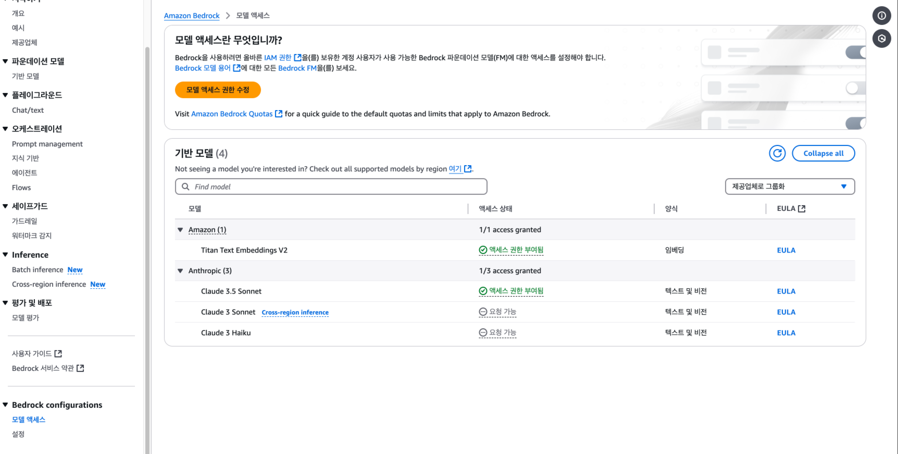

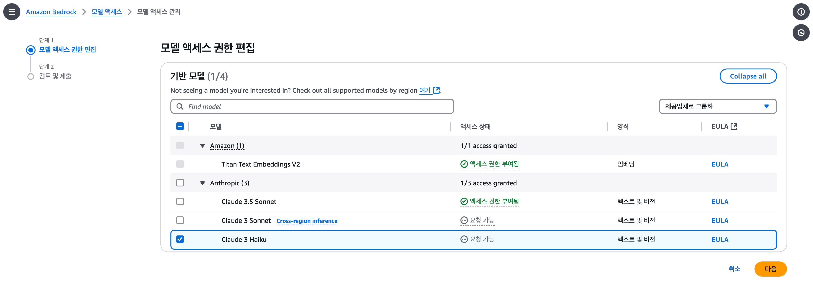

다음을 누르면, 회사 정보를 넣으라고 하는데 그냥 학습용이면 대충 넣어도 괜찮습니다.

2. Knowledge Base 생성

모델 엑세스 권한을 얻기만 해도 Chat GPT처럼 챗봇을 쓸 수 있지만, Knowledge Base를 생성해서 더 멋진 모델을 만들어보겠습니다.

Amazon Bedrock → 오케스트레이션 → 지식 기반 으로 이동하고 지식 기반 생성을 누릅니다.

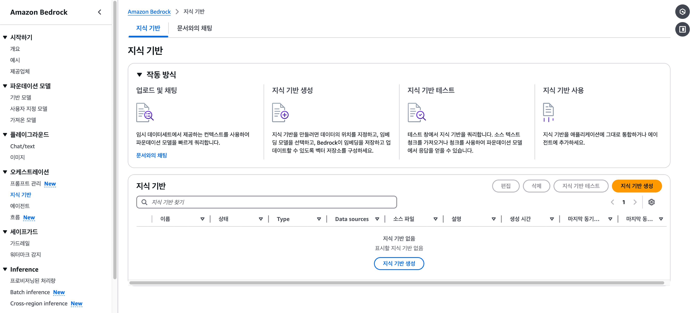

권한 등은 있던 걸 사용해도 되고 아마 대부분이 없을테니까 새로 만드는 옵션을 선택하면 됩니다.

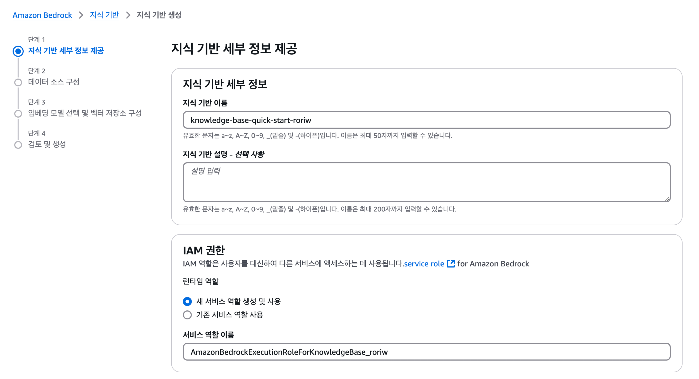

데이터 소스는 S3를 선택하겠습니다. (S3에 마크다운을 넣어서 지식 베이스로 사용할 예정입니다)

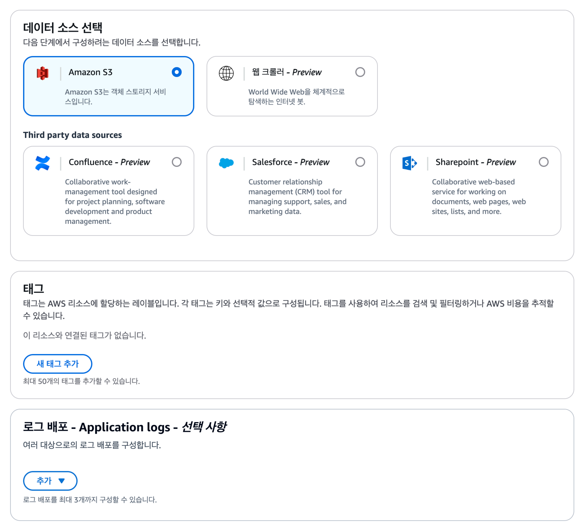

다음으로 넘어가면 S3 버킷을 선택하라고 하는데, S3 버킷을 선택하고 다음을 누르면 생성이 완료됩니다.

(S3가 없으면 만들어야 해요.)

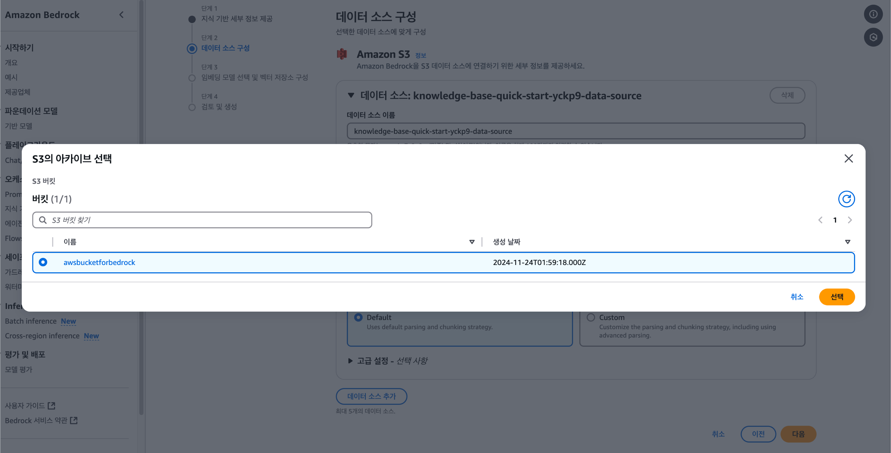

그리고 청킹 옵션을 선택할 수 있는데, 쉽게 설명하면 데이터를 어떻게 잘라서 저장할 지에 대한 옵션입니다.

Knowledge Base는 벡터 데이터베이스를 사용해서, 이 Chunking 옵션을 선택하는 것이 중요합니다.

저는 이 중에서 Semantic Chunking을 선택했습니다. → 의미적으로 유사한 텍스트 청크 또는 문장 그룹으로 콘텐츠를 분할하는 옵션입니다.

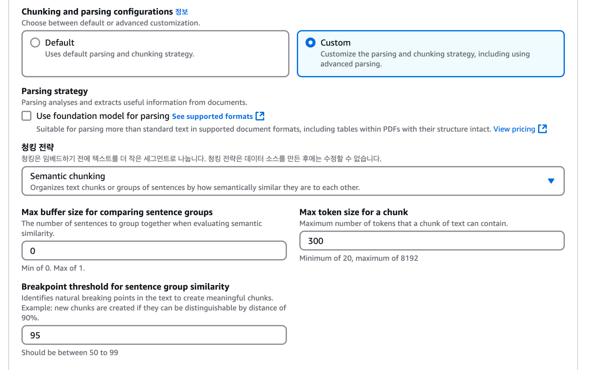

마지막으로 임베딩 모델을 선택하고, 생성을 누르면 Opensearch Serverless로 벡터 데이터베이스로 Knowledge Base가 생성됩니다.

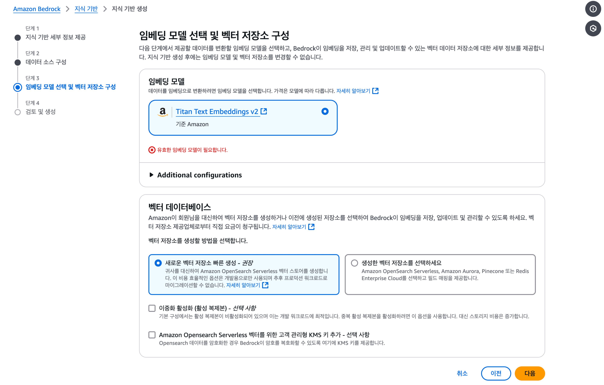

이 이미지는 제가 예전에 정리하던 블로그인데... 약 200개 정도의 페이지가 있습니다.

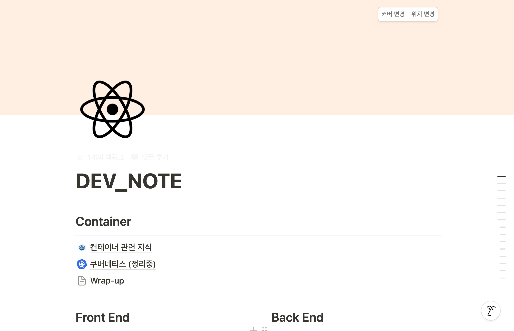

내보내기를 하면, 하위 모든 경로의 문서를 마크다운으로 내보낼 수 있어요.

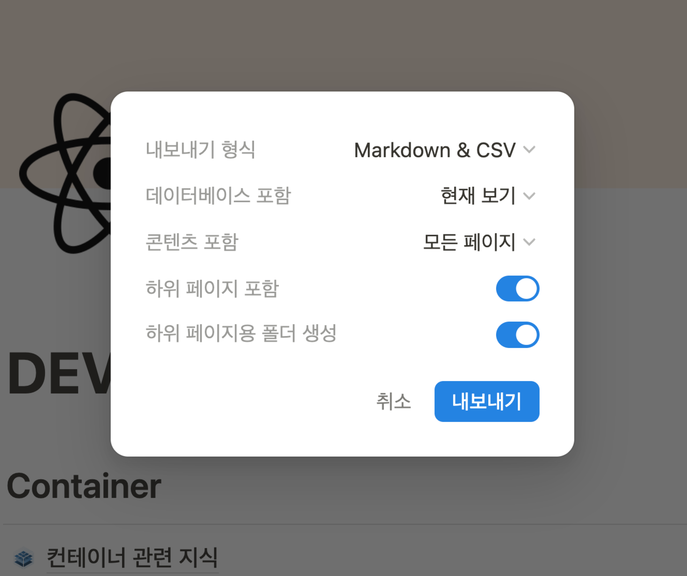

이렇게 내보낸 마크다운을 S3에 넣어서 Knowledge Base로 사용하면 됩니다.

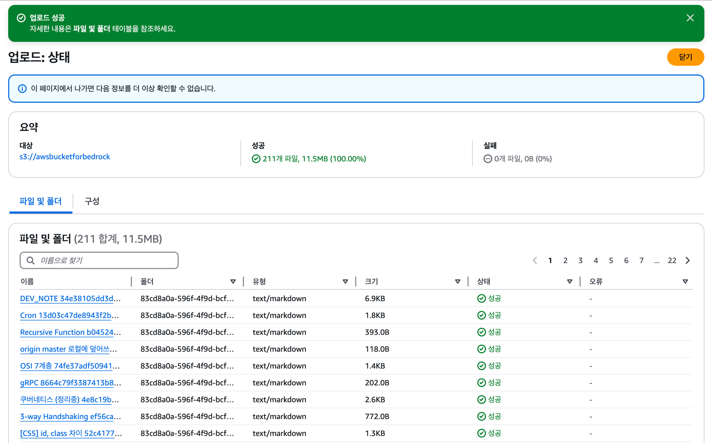

제가 이전에 쓰다 중단한 글이 있는데... 과연 이 정보를 알아낼 수 있을지 테스트해보겠습니다.

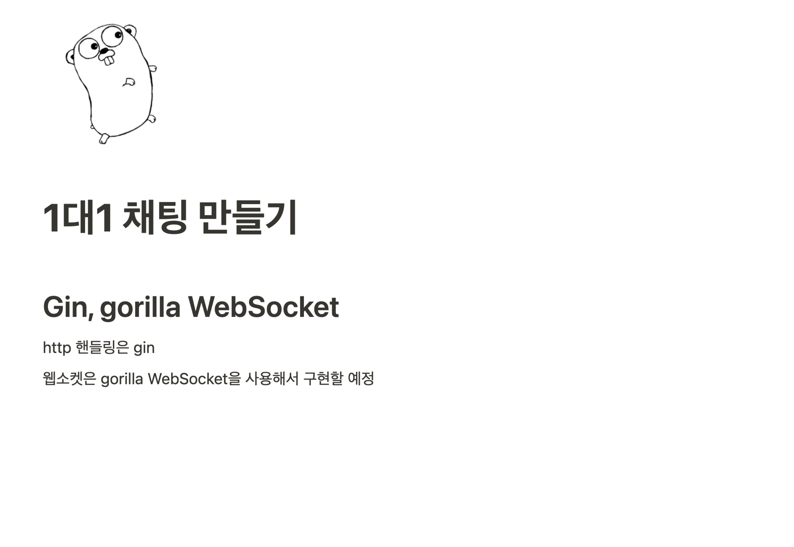

잘 찾아주네요. 푸하하 😊

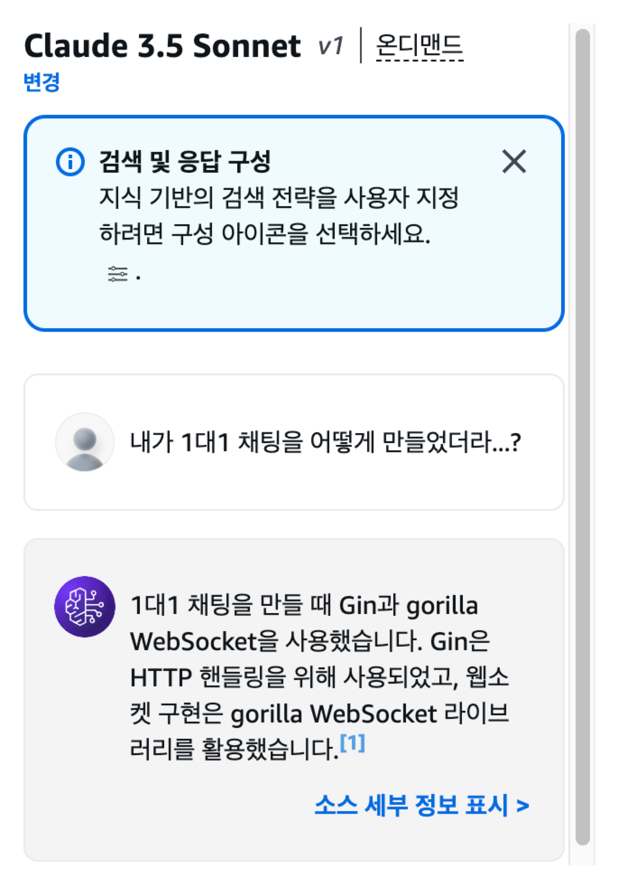

# 마치며

이번 글에서는 Amazon Bedrock에 대해 알아보았습니다.

Bedrock은 빠르고 쉽게 파운데이션 모델을 구축할 수 있어요.

Knowledge Base를 사용하면 최신 정보를 제공하고, 데이터 보안을 유지하며, 할루시네이션을 완화하고, 모델 재학습을 불필요하게 만들 수 있습니다.

그리고 얼마나 쉽게 사용할 수 있는지도 확인해보았구요.

개인적으로 이걸 어떻게 사용할 수 있을지 고민해보면서, 더 많은 기능을 사용해보고 싶어졌습니다.
