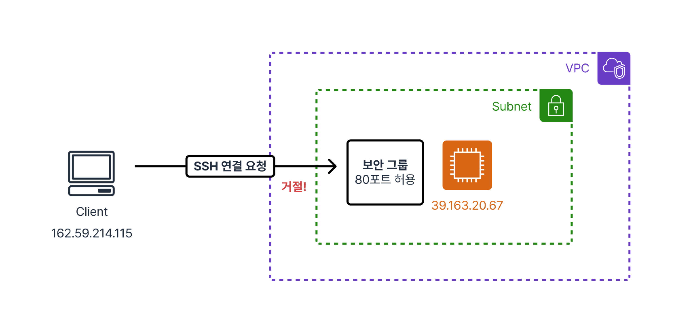
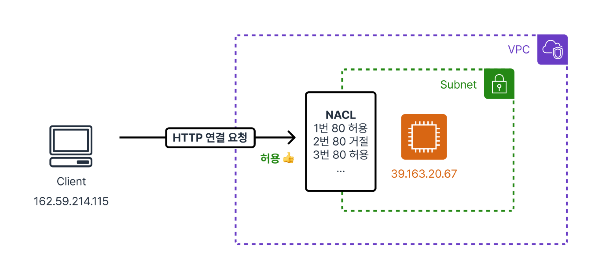
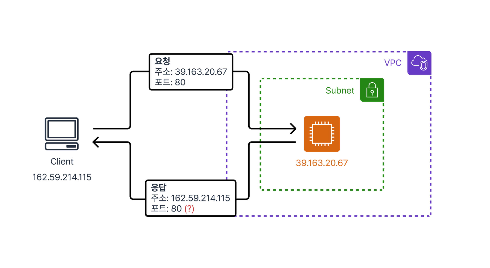
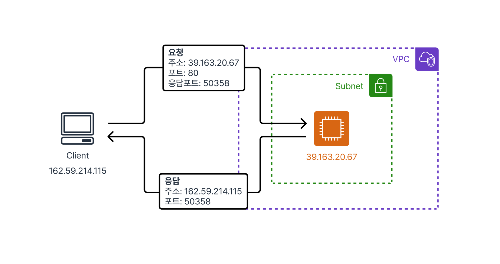
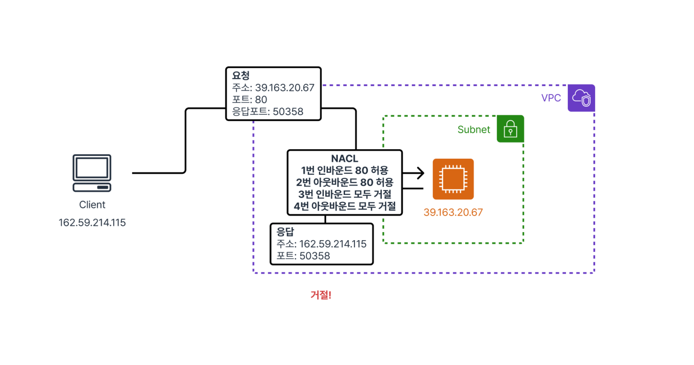
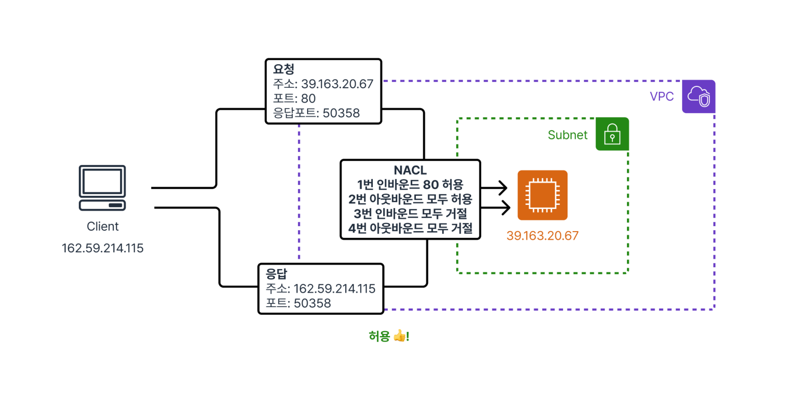

+++
title="Amazon VPC 보안 그룹과 CIDR 알아보기"
date=2024-10-13 09:00:00
updated=2024-10-13
description="Amazon VPC 보안 그룹과 CIDR에 대해 알아보는 글입니다."

[taxonomies]
tags=["AWS", "VPC", "Secrity Group", "NAC", "CID"]

[extra]
toc=true
giscus=true
quick_navigation_buttons=true
katex = true
+++

# 들어가며

Amazon VPC는 Virtual Private Cloud의 약자로, VPC 덕분에 우리는 논리적으로 격리된 공간을 사용할 수 있습니다.

SAA를 공부하면서 VPC 관련해서 복잡한 내용은 제외하고 기본적인 내용들만 이번 글에서 정리해볼 예정입니다.

그럼 시작해보겠습니다. 😊

# CIDR (Classless Inter-Domain Routing)

CIDR은 네트워크를 나타내는 방법입니다.

사이다(?)라고도 읽습니다 푸하하

앞으로 설명할 보안 그룹과 NACL은 CIDR을 사용해서 네트워크를 표현합니다.

예를 들어 10.0.0.0/16이라는 CIDR은 10.0.0.0부터 10.0.255.255까지를 의미합니다.

그래서 10.0.0.0/16 허용!이라고 말하면 10.0.0.0부터 10.0.255.255까지 IP를 모두 허용하는 것이죠.

CIDR에서 /16은 네트워크 프리픽스의 길이를 나타냅니다. 즉, 앞의 16비트는 네트워크 주소를 나타내고, 나머지 16비트는 호스트 주소를 나타냅니다.

이 글에서는 IP 범위구나~ 정도로 넘어가고 자세한 내용은 [CIDR이란 무엇인가요?](https://aws.amazon.com/ko/what-is/cidr/) 참고해보세요!

# 보안 그룹 (Security Group)

보안 그룹은 AWS에서 인스턴스 레벨로 인바운드(들어오는)와 아웃바운드(나가는) 트래픽을 제어하는 가상 방화벽입니다.

기본적으로 **‘화이트리스트’** 방식으로 동작하기 때문에 명시적으로 허용한 트래픽만 통과됩니다. 별도로 설정하지 않으면 모든 트래픽이 차단됩니다.

또한 보안 그룹의 특징 중 하나는 Stateful하다는 것입니다.

## Stateful? Stateless?

Stateful하다는 의미는 인바운드 트래픽이 허용되면 그에 대한 아웃바운드 트래픽도 자동으로 허용된다는 것입니다.

인바운드로 트래픽이 허용되면 해당 연결에 대한 세션을 기억합니다.

그리고 이 상태를 추적해서 동일한 연결의 아웃바운드 트래픽은 별도로 허용하지 않아도 통과되는 것이죠.

그렇다면 Stateless한 녀석이 있을까요?

# 네트워크 ACL (Network ACL)

NACL은 보안 그룹과 비슷하지만 **Stateless**하다는 특징을 가지고 있습니다.

**Stateless** 하다는 의미를 설명하기 전에, **NACL은 서브넷 레벨에서 적용**된다는 점을 먼저 알아두어야 합니다.

그림에서 보이는 것과 같이 규칙에는 **우선순위**가 있습니다.

80번 포트를 거절했다고 해도 더 높은 우선순위의 규칙이 80번 포트를 허용한다면 통과됩니다.

이게 중요한 이유를 설명하려면 HTTP 요청 과정을 이해하면 좋습니다.

## HTTP 요청 과정

우리가 컴퓨터에서 웹서버로 HTTP 요청을 보낸다고 가정해보겠습니다.

TCP 프로토콜은 요청할 때 출발지 주소와 포트, 목적지 주소와 포트를 명시해서 요청을 보냅니다. HTTP 요청이니까 목적지 포트는 80번이고, 웹서버의 IP 주소로 요청을 보내죠.

그럼 웹서버는 클라이언트에게 어떻게 응답할까요?

설마 80번 포트만 열어두면 응답을 보낼 수 있을까요? (사실 제가 그런 줄 알았습니다. 헤헤)

클라이언트는 자신의 IP 주소와 **임시로 할당된 소스 포트(예: 50358)** 를 사용하여 요청을 보냅니다. 웹서버는 요청을 받은 후, 응답을 보낼 때 클라이언트의 IP 주소와 소스 포트로 응답합니다.

즉, 클라이언트는 임시 포트를 사용하고, 웹서버는 그 포트로 응답을 보내는 것이죠.

만약 NACL의 아웃바운드 규칙에서 포트 80만 허용하고 나머지 포트를 모두 막아두면, 웹서버에서 클라이언트의 임시 포트로 응답을 보낼 수 없게 되어 오류가 발생할 수 있습니다.

앞에서 다뤘던 보안 그룹은 **Stateful** 하기 때문에 아웃바운드 규칙을 별도로 허용하지 않더라도 들어온 세션은 무조건 나갈 수 있도록 보장하지만, NACL의 경우는 아웃바운드 포트를 전체적으로 열어두는 것이 좋습니다.

## 다시 NACL로 돌아오며

VPC 생성 시 기본적으로 하나의 Default NACL이 생성되는데, 이 친구는 모든 인바운드 및 아웃바운드 트래픽을 허용하도록 설정되어 있습니다.

기본 NACL을 수정할 수도 있지만, 별도의 NACL을 생성해서 사용하는 것을 권장합니다. 이를 통해 보다 세부적인 네트워크 트래픽 제어가 가능합니다.

# 라우팅 테이블 (Routing Table)

라우팅 테이블은 서브넷에 연결되어 있는 라우팅 규칙을 의미합니다.

길잡이 같은 역할로, 패킷을 어디로 보내야 할지 결정하는 역할을 합니다.

👉 라우팅 테이블은 데이터를 목적지로 보내기 위해 사용됩니다.

라우팅 테이블의 형태는 기본적으로 `Destination` - `Target`으로 이루어져 있습니다.

- `Destination`은 CIDR을 사용해서 표현합니다.
- `Target`은 패킷을 보낼 곳을 의미합니다.

예를 들어 1.2.3.4/32라는 CIDR을 지정하면, 1.2.3.4라는 IP 주소로 패킷을 보낼 때 해당 라우팅 테이블을 참조하게 되는 것이죠.

Target은 로컬 네트워크로 보낼 수도 있고, 인터넷 게이트웨이로 보낼 수도 있습니다.

만약 조건에 해당하는 라우팅 테이블 엔트리가 없다면, 패킷은 그냥 **삭제(Drop)** 됩니다.

물론 0.0.0.0/0이라는 CIDR을 지정해서 기본 라우팅 경로를 설정할 수도 있습니다.

라우팅 테이블 관련해서 더 자세한 내용은 Private Subnet을 다루는 글에서 정리해보겠습니다. 😉

# 마치며

이번 글에서는 CIDR, 보안 그룹, 그리고 NACL에 대해 정리하려고 했지만 라우팅 테이블까지 다루게 되었습니다.

다음 글에서는 VPC 서브넷, 퍼블릭 서브넷과 프라이빗 서브넷에 대해 정리해보겠습니다. 😊 👍
