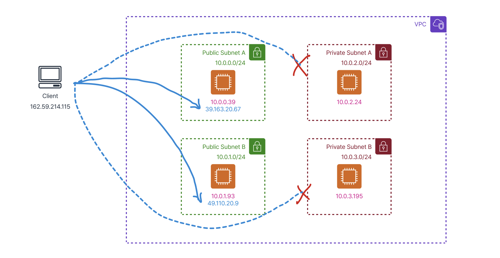
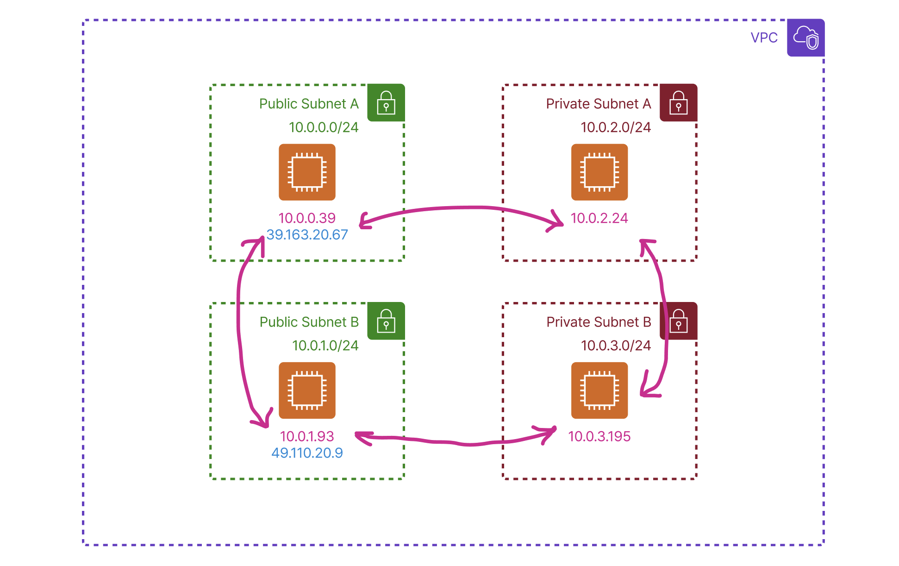

+++
title="Amazon VPC Private Subnet 알아보기"
date=2024-10-27 03:00:00
updated=2024-10-27
description="Amazon VPC Private Subnet 과 NAT Gateway 를 효과적으로 활용하여 필요한 인터넷 연결을 유지하면서 외부 액세스를 제한하여 AWS 네트워크 보안을 강화하는 방법을 알아보아요"

[taxonomies]
tags=["AWS", "VPC", "Subnet", "NAT Gateway"]

[extra]
toc=true
giscus=true
quick_navigation_buttons=true
katex=true
+++

# 들어가며

이번 포스트에서는 Amazon VPC의 Private Subnet을 어떻게 잘 활용할 지에 대한 내용을 다뤄보겠습니다.

우리는 소중한 자산을 지키지 위해 보안 수준을 높이기 위한 조치를 취합니다.

보안을 높이는데 다양한 방법이 있고, 그 중 네트워크 환경에서 외부의 접근을 제한하는 방법에 대해서 알아보겠습니다.

# Subnet?

우선 VPC는 **리전(Region)** 단위로 생성되고, 해당 영역의 모든 가용 영역을 포함합니다.

서브넷은 VPC 안에서 구성되는 단위로, 한 서브넷은 특정 가용영역에 속합니다.

## 그렇다면 Public, Private는 왜 나뉘는 거지?

**Public Subnet** 은 Public IP 또는 Elastic IP를 할당받아 외부에 노출되는 주소를 가지고 있습니다. 

→ 이러한 인스턴스들은 **인터넷 게이트웨이(Internet Gateway)** 를 통해 외부 인터넷과 직접 통신할 수 있죠.

반면에 **Private Subnet** 은 Public IP를 가지지 않는 인스턴스들이 위치하며, 인터넷 게이트웨이와 직접 연결되어 있지 않습니다. 

→ 외부에서는 접근할 수 없고, 내부에서만 통신이 가능하다는 말이죠.

> 인터넷으로 접근하는 요청은 Public에서만 가능

> VPC 내부의 모든 서브넷들은 통신이 가능

## 그런데, 나는 Private 에 있는데 인터넷에 연결하고 싶은데...?

Private Subnet 내부의 서버에서 다른 서비스의 API를 호출할 수도 있고,

외부 패키지를 설치하고 싶을 수 있습니다.

이럴 때 쓰는 것이 바로 **NAT Gateway** 입니다.

# NAT Gateway

NAT Gateway를 사용하면 Private Subnet의 인스턴스들이 외부 인터넷에 접근할 수 있게 됩니다.

이는 아웃바운드 트래픽에 한정되며, 외부에서 Private Subnet의 인스턴스로의 인바운드 트래픽은 여전히 차단됩니다.

이렇게 하면 보안을 유지하면서도 필요한 외부 리소스에 접근할 수 있죠.

NAT Gateway 설정 방법

1. NAT Gateway 생성
  - 퍼블릭 서브넷에서 NAT Gateway를 생성합니다.
  - Elastic IP를 할당하여 외부 인터넷과의 통신이 가능하도록 합니다.
2. 라우팅 테이블 수정
  - Private Subnet의 라우팅 테이블에 다음과 같은 경로를 추가합니다:
	- Destination: 0.0.0.0/0 (모든 외부 트래픽)
	- Target: 생성한 NAT Gateway

이렇게 하면 Private Subnet의 인스턴스들은 인터넷으로의 아웃바운드 요청을 수행할 수 있습니다. 👍

# NAT Gateway의 동작 원리

NAT(Network Address Translation) Gateway는 Private Subnet의 인스턴스들이 가지고 있는 프라이빗 IP 주소를 퍼블릭 IP 주소로 변환하여 외부 인터넷과 통신할 수 있게 해줍니다. 

우린 이제 내부 IP를 가진 인스턴스들도 외부 서비스(API 호출, 패키지 설치 등)에 대해서 문제 없이 수행할 수 있죠.

### 정리

**아웃바운드(나가는) 트래픽**: Private Subnet의 인스턴스 → NAT Gateway → 인터넷

**인바운드(들어오는) 트래픽**: 인터넷 → NAT Gateway에서 차단 (인스턴스로의 직접 접근 불가)

# 주의할 점

- 비용 발생: NAT Gateway 사용에는 시간당 비용과 데이터 처리량에 따라서 비용이 발생합니다 👉 그것도 모르고 예전에 돈을 많이 잃었던 기억이...
	
- 고가용성 고려가 필요해요: 여러 **가용 영역(Availability Zone)** 에 NAT Gateway를 구성하여 장애 발생 시에도 서비스가 지속되도록 설계할 수 있습니다.

- 보안 그룹 설정: NAT Gateway 자체에는 보안 그룹을 설정할 수 없지만, 인스턴스의 **보안 그룹(Security Group)** 과 네트워크 ACL을 적절히 설정하여 보안을 강화하면 럭키가 안비키겠죠? 🍀

# 마치며

이번 포스트에서는 Amazon VPC에서 Private Subnet을 활용하여 보안 수준을 높이는 방법과, NAT Gateway를 통해 필요한 인터넷 접근을 가능하게 하는 방법에 대해 알아보았습니다.

보안을 위해 외부 접근을 제한하는 것은 중요하지만, 업무상 필요한 외부 서비스에 대한 접근까지 막는 것은 조금 무리가 있죠.

NAT Gateway를 적절히 활용하면 이러한 문제를 해결할 수 있으며, 보안과 기능성을 모두 만족하는 네트워크 환경을 구축할 수 있을 거라고 생각합니다.

