+++
title="Code Coverage in Java"
date=2024-06-24 15:00:00
updated=2024-06-24
description="Java에서 코드 커버리지를 측정하는 방법과 JaCoCo 라이브러리를 사용한 후기를 알아봅니다."

[taxonomies]
tags=["depromeet", "java", "code-coverage", "jacoco"]

[extra]
giscus = true
quick_navigation_buttons = true
toc = true
+++

# Code Coverage란?

우리가 만든 애플리케이션을 테스트할 때 얼마나 많은 코드가 실제로 실행되는지를 측정하는 지표인데요, 이걸 보통 테스트 커버리지 또는 코드 커버리지라고 해요.

이번엔 디프만 15기로 진행하는 프로젝트에서 JaCoCo라는 라이브러리를 사용할 기회가 있어서 이를 이용한 후기를 남겨보려고 합니다.

# Code Coverage가 왜 필요할까요?

코드의 품질을 높이기 위해 우린 보통 테스트 코드를 작성하는데 프로젝트 크기가 적을 때야 뭐 테스트가 있는 지 파일을 하나하나 열어서 확인할 수 있지만, 프로젝트가 커지면 이건 불가능에 가까워져요.

그래서 우리 **코드에 얼마나 테스트 코드가 작성됐는가** 가 커버리지의 목적이라고 봐도 괜찮을 것 같아요.

오픈소스를 선택할 때에도 코드 커버리지가 높은 프로젝트라면 더욱 신뢰할 수 있지 않을까요?

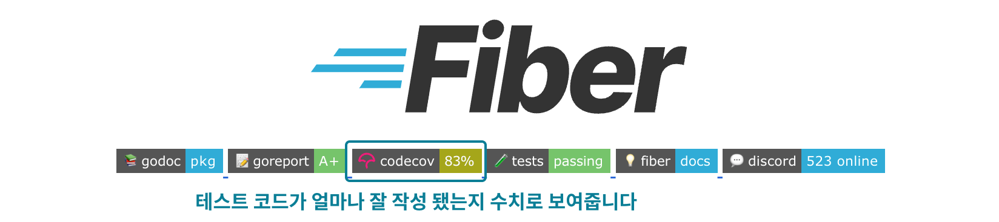

(go-fiber라는 오픈소스의 README.md에 있는 코드 커버리지 예시)

# JaCoCo란?

JaCoCo는 **Ja**va **Co**de **Co**verage 라이브러리로, Java 바이트 코드 수준에서 코드 커버리지를 측정할 수 있어요.

다음은 JaCoCo의 실행 결과를 보여주는 그림인데요, 강조한 부분 (Instruction, Branch, Complexity, Line, Method, Class) 등이 바로 우리가 주목해야 할 지표들입니다.

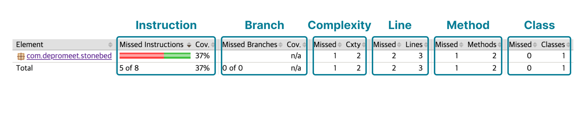

JaCoCo는 커버리지 메트릭을 계산하기 위해 다양한 Counter를 사용해요.

자바 클래스 파일에 포함된 정보, 즉 바이트 코드와 디버그 정보를 사용하죠.

그래서 소스 코드가 없어도 애플리케이션을 실시간으로 분석하고 코드에 대한 정보를 수집할 수 있다고 합니다.

### 이게 그렇게 좋은 건가..? 바이트 코드 수준에서 측정하는 건 왜 좋을까?

우린 보통 소스코드를 작성하면서 테스트 코드를 작성하기 때문에 이게 왜 좋은 건지 잘 와닿지 않을 수 있습니다.

그렇다면 이런 상황은 어떨까요?

**🤔 실제로 운영중인 서버에서 직접 API를 호출해서 커버리지를 측정해보고 싶다.**

이런 상황이라면 이미 컴파일된 바이트 코드를 사용해야 하기 때문에 소스코드에 의존하고 있지 않는 좋은 예시라고 볼 수 있어요.

구현해보고 싶다면 JaCoCo Agent를 보면 좋아요. - [공식 문서](https://www.jacoco.org/jacoco/trunk/doc/agent.html)

output 옵션의 기본값이 file 이라서 애플리케이션 종료시 결과 파일을 생성해요.

개인적으로 필요성은 느끼지 못하지만 tcp 소켓 옵션을 사용한다면 실시간으로도 분석이 가능하겠네요.

**🤔 소스코드에 의존하지 않는데 어떻게 라인 커버리지에 대한 리포트를 제공하지...?**

리포트를 생성할 때에는 소스코드를 활용해요. 그래서 리포트 자체는 바이트 코드 + 디버그 정보를 통해 커버리지 결과를 생성하고, 소스코드에 매핑하는 방식으로 이루어져요.

# JaCoCo 세팅하기

JaCoCo를 사용하기 위해선 먼저 프로젝트에 의존성을 추가해야 해요.

```groovy
// build.gradle

plugins {
    id 'java'
    id 'jacoco'  // jacoco 플러그인 추가
}

group = 'org.example'
version = '1.0-SNAPSHOT'

repositories {
    mavenCentral()
}

dependencies {
    testImplementation platform('org.junit:junit-bom:5.10.0')
    testImplementation 'org.junit.jupiter:junit-jupiter'
}

test {
    useJUnitPlatform()
    finalizedBy jacocoTestReport  // test task가 끝나면 jacocoTestReport task 실행
}

jacoco {
    toolVersion = "0.8.12"  // jacoco 버전
}

jacocoTestReport {  // 여기가 위에 finalizedBy jacocoTestReport 와 연결되는 부분
    dependsOn test  // test task가 끝나면 jacocoTestReport task 실행
    reports {
        xml.required.set(true)  // xml 리포트 생성
        html.required.set(true)  // html 리포트 생성
        csv.required.set(true)  // csv 리포트 생성
    }
}
```

위와 같이 설정하면 `./gradlew test` 를 실행하면 JaCoCo 리포트를 생성할 수 있어요.

html 파일의 경로는 기본적으로 `build/reports/jacoco/test/html/index.html` 입니다.

다른 경로에 저장하고 싶다면 이런 식으로 설정하면 됩니다.

```groovy
...

jacocoTestReport {
    ...
    reports {
        ...
        html.destination file("$buildDir/reports/jacoco")
    }
}
```

`JacocoTestReport`에 대한 더 자세한 옵션들은 [공식 문서](https://docs.gradle.org/current/dsl/org.gradle.testing.jacoco.tasks.JacocoReport.html)를 통해 확인할 수 있어요.

# 이걸로 뭘 측정해야 할까요?

JaCoCo는 다음과 같은 커버리지 메트릭을 제공해요.

## Instruction (C0): 코드 내의 모든 명령어들을 실행했는지

가장 작은 단위의 코드 커버리지 측정 방식이에요.

특정 코드가 실행되었는지 여부를 확인할 때 사용해요.

**예시**

```java
// Example.java

public class Example {
    public void exampleMethod() {
        int a = 1;  // Line 1
        int b = 2;  // Line 2
        int c = a + b;  // Line 3
        System.out.println(c);  // Line 4
    }
}
```

```java
// ExampleTest.java

public class ExampleTest {
    @Test
    public void testExampleMethod() {
        Example example = new Example();

        example.exampleMethod();
    }
}
```

`exampleMethod()` 를 테스트하는 시나리오라고 가정하면, jacoco 에서 커버리지를 계산하는 건 다음과 같이 이루어져요.

#### Instruction 커버리지 결과

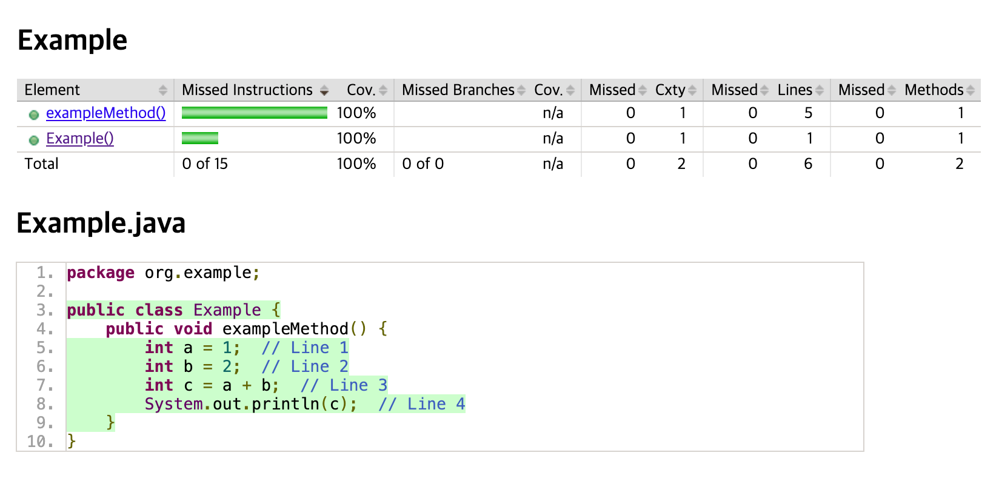

코드의 모든 명령어들이 실행됐기 때문에 Instruction 커버리지는 100%가 됩니다.

#### JaCoCo 동작 방식 - 바이트코드 기반

바이트코드로 변환하면 다음과 같아요. (Instruction 커버리지에 한해서만 예시를 포함하겠습니다. 나머지도 동작 방식은 동일하기 때문)

```java
public class org.example.Example {
  public org.example.Example();
    Code:
       0: aload_0
       1: invokespecial #1                  // Method java/lang/Object."<init>":()V
       4: return

  public void exampleMethod();
    Code:
       0: iconst_1
       1: istore_1
       2: iconst_2
       3: istore_2
       4: iload_1
       5: iload_2
       6: iadd
       7: istore_3
       8: getstatic     #7                  // Field java/lang/System.out:Ljava/io/PrintStream;
      11: iload_3
      12: invokevirtual #13                 // Method java/io/PrintStream.println:(I)V
      15: return
}
```

`exampleMethod()` 를 테스트하는 시나리오라고 가정하면, jacoco 에서 커버리지를 계산하는 건 다음과 같이 이루어져요.

- `iconst_1` 실행완 ✅
- `istore_1` 실행완 ✅
- `iconst_2` 실행완 ✅
- ...(생략)...
- `return` 실행완 ✅

그리고 바이트코드와 실행 결과를 비교해서 결과를 제공하죠.

{{ 
    admonition(
        type="tip", 
        title="팁", 
        text="C0/C1 는 코드 커버리지의 종류를 나타내는 지표입니다. 줄임말이라고 생각하면 될 것 같아요."
    )
}}

## Branch (C1): 조건문의 참/거짓을 모두 실행했는지

분기 커버리지는 모든 `if` 및 `switch` 문의 조건을 실행했는지 확인하는 지표에요.

```java
// BranchExample.java

public class BranchExample {
    public void checkValue(int value) {
        if (value > 0) {  // Line 1
            System.out.println("Positive");  // Line 2
        } else if (value < 0) {  // Line 3
            System.out.println("Negative");  // Line 4
        } else {
            System.out.println("Zero");  // Line 5
        }
    }
}
```

```java
// BranchExampleTest.java

public class BranchExampleTest {

    @Test
    public void testPositiveValue() {
        BranchExample example = new BranchExample();
        example.checkValue(1);
    }
}
```

#### Branch 커버리지 1차 결과

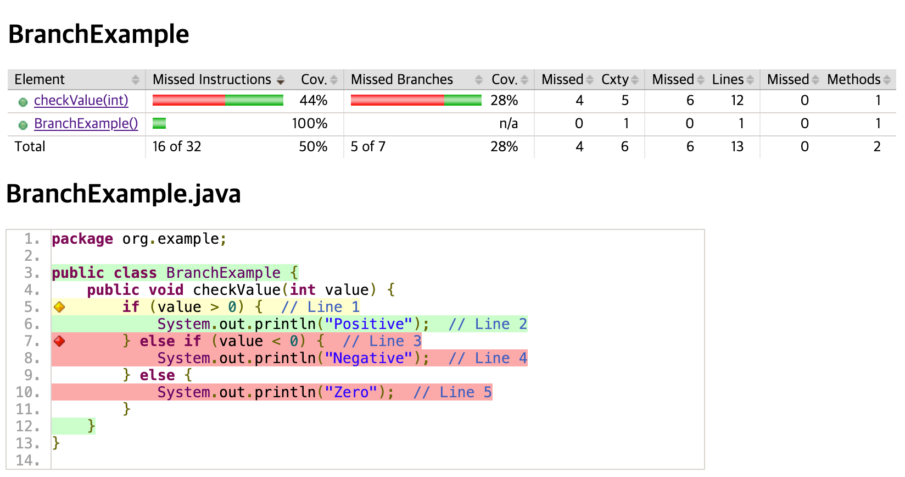

`checkValue(1)` 만 테스트했기 때문에 실행하지 않은 명령어들 앞에 노란색과 빨간색 다이아몬드가 표시되어요.

분기 커버리지는 다음과 같이 계산되어요.

- **No Coverage (빨간색 다이아몬드)**: 해당 라인의 분기 중 하나도 실행되지 않음.
- **Partial Coverage (노란색 다이아몬드)**: 해당 라인의 일부 분기만 실행됨.
- **Full Coverage (녹색 다이아몬드)**: 해당 라인의 모든 분기가 실행됨.

초록 다이아몬드 예시 (테스트코드에 0, -1 추가)

```java
// BranchExampleTest.java

public class BranchExampleTest {

    @Test
    public void testPositiveValue() {
        BranchExample example = new BranchExample();
        example.checkValue(1);
        example.checkValue(0);
        example.checkValue(-1);
    }
}
```

#### Branch 커버리지 2차 결과

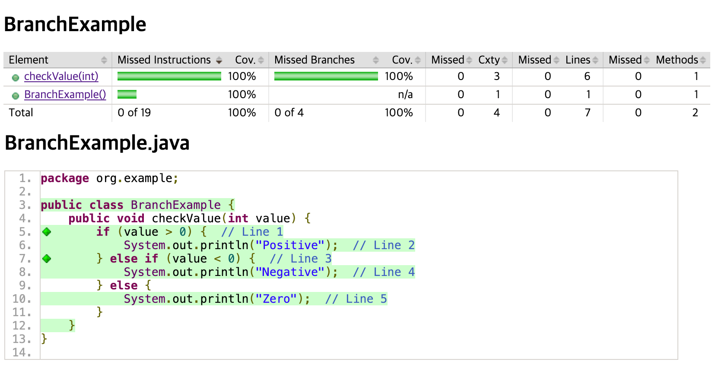

{{ 
    admonition(
        type="warning", 
        title="주의", 
        text="배경색은 Line 커버리지를 나타내는 지표이며, Branch 커버리지와는 관련이 없어요. 다이아몬드만 보면 됩니다!"
    )
}}

## Cyclomatic Complexity: 프로그램의 복잡성을 측정하는 지표

순환 복잡도는 각 메서드의 복잡성을 측정하는 지표에요.

[McCabe](http://www.mccabe.com/pdf/mccabe-nist235r.pdf)에 의해 정의된 개념으로, 메서드를 통해 가능한 모든 경로를 생성할 수 있는 최소 경로 수를 의미하죠.

{{ 
    admonition(
        type="tip", 
        title="팁", 
        text="순환 복잡도는 추상 메서드가 아닌 메서드 (Non-abstract method) 에만 적용됩니다."
    )
}}

#### 공식 정의

순환 복잡도 `v(G)` 의 공식 정의는 메서드의 제어 흐름 그래프(Control Flow Graph)를 유향 그래프(Directed Graph)로 나타내는 것에 기반해요.

```PlainText
v(G) = E - N + 2
```

- `E`: 엣지 수
- `N`: 노드 수

JaCoCo는 분기 `B` 와 결정점 `D` 를 사용해서 순환 복잡도를 계산해요.

```PlainText
v(G) = B - D + 1
```

#### Cyclomatic Complexity 예시

```java
// ComplexityExample.java

public class ComplexityExample {
    public void exampleMethod(int value) {
        int total = 0;
        for (int i = 0; i<=value; i++) {
            if (i % 2 == 1)
                total += i;
        }
        System.out.println(total);
    }
}

```

이런 코드가 있다고 가정해보겠습니다. (순환 복잡도는 확인만 하기 위해 테스트코드는 생략하겠습니다.)

JaCoCo에서 사용하는 공식에 따라 Decision Points `D` 와 Branches `B` 를 계산해보면 다음과 같아요.

결정점 `D` = 2

1. `for` Loop (`i <= value`)
2. `if` Statement (`i % 2 == 1`)

분기 `B` = 4 (2 + 2)

1. `for` Loop 의 두 가지 경우 (루프 내부와 루프 종료)
2. `if` Statement 의 두 가지 경우 (True, False)

공식을 써서 계산하면 다음과 같아요.

```PlainText
v(G) = B - D + 1
     = 4 - 2 + 1
     = 3
```

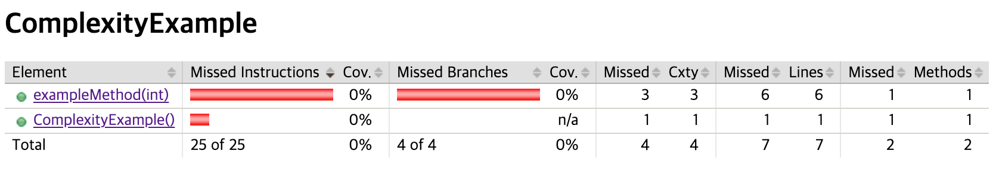

`exampleMethod()` 의 `Cxty` 가 3이 되는 걸 확인할 수 있어요.

## Line: 코드의 모든 라인을 실행했는지

C0, C1 커버리지와 비슷하지만, 라인 커버리지는 코드의 모든 라인을 실행했는지 확인하는 지표에요.

HTML 리포트에서는 배경의 색을 다음과 같이 표현하는데요,

- **No Coverage (빨간색 배경)**: 해당 라인의 명령어가 하나도 실행되지 않음.
- **Partial Coverage (노란색 배경)**: 해당 라인의 일부 명령어만 실행됨.
- **Full Coverage (녹색 배경)**: 해당 라인의 모든 명령어가 실행됨.

```java
// LineExample.java

public class LineExample {
    public void exampleMethod(int value) {
        if (value < 0) {
            System.out.println("Negative!");
            return;
        }

        System.out.println(value);
    }
}
```

```java
// LineExampleTest.java

public class LineExampleTest {

    @Test
    public void testExampleMethod() {
        LineExample example = new LineExample();
        example.exampleMethod(10);
    }
}
```

#### Line 커버리지 결과

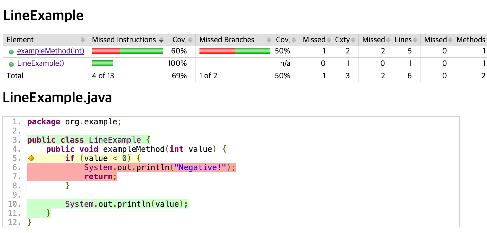

`exampleMethod(10)` 을 테스트했기 때문에 `if` 문의 `value < 0` 조건이 False가 되어 `System.out.println("Negative!")` 가 실행되지 않았습니다.

그래서 조건문인 `if` 문의 라인은 Partual Coverage가 되어 노란색 배경으로 표시되었고, 조건문 본문 라인은 No Coverage가 되어 빨간색 배경으로 표시되었습니다.

최종적으로 빨간 배경이 커버리지가 떨어진 부분으로 Missed가 2인 것이 확인됩니다.

## Method: 메서드가 실행되었는지

말 그대로 메서드가 실행되었는지 확인하는 지표에요.

{{ 
    admonition(
        type="tip", 
        title="팁", 
        text="메서드 커버리지에서도 추상 메서드가 아닌 메서드 (Non-abstract method) 에만 적용됩니다."
    )
}}

```java
// MethodExample.java

public class MethodExample {
    public void exampleMethod() {
        System.out.println("Hello, World!");
    }

    public void otherMethod() {
        System.out.println("Hello, World!");
    }
}
```

```java
// MethodExampleTest.java

public class MethodExampleTest {

    @Test
    public void testExampleMethod() {
        MethodExample example = new MethodExample();
        example.exampleMethod();
    }
}
```

#### Method 커버리지 결과

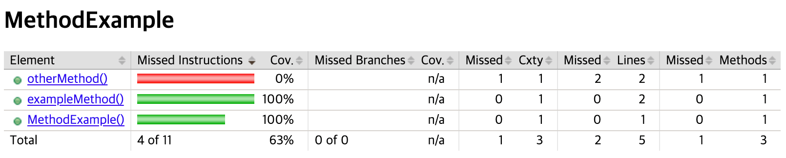

`exampleMethod()` 을 테스트했기 때문에 `otherMethod()` 가 실행되지 않았습니다.

그래서 `otherMethod()` 의 `Methods` 왼쪽의 `Missed` 가 0으로 나오죠.

## Class: 클래스가 실행되었는지

마지막으로 클래스가 실행되었는지 확인하는 지표에요.

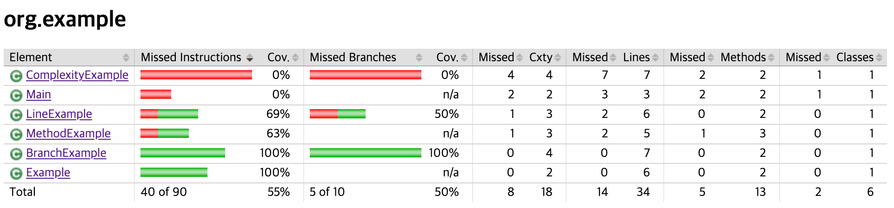

앞에 테스트를 작성하지 않은 클래스들이 있는데 `Classes` 왼쪽의 `Missed` 가 0으로 나오는 것을 확인할 수 있어요.

# 코드의 품질을 높이기 위한 커버리지 제한 설정하기

좋은 코드를 작성하기 위해 앞에 설명한 다양한 커버리지 메트릭을 측정하고, 빌드 시 이를 제한하는 방법도 있는데요

[JacocoCoverageVerification](https://docs.gradle.org/current/dsl/org.gradle.testing.jacoco.tasks.JacocoCoverageVerification.html) task를 사용하면 이를 설정할 수 있어요.

```groovy
// build.gradle

jacocoTestCoverageVerification {
    violationRules {
        rule {
            limit {
                minimum = 0.8
            }
        }
    }
}
```

위와 같이 설정하면 커버리지가 80% 미만이면 빌드가 실패하도록 설정할 수 있어요.

여기선 카운터를 명시하지 않았는데, 기본값은 `INSTRUCTION` 이에요.

다른 카운터를 사용하고 싶다면 다음과 같이 설정하면 됩니다.

```groovy
// build.gradle

jacocoTestReport {
    ...

    finalizedBy jacocoTestCoverageVerification  // testReport task가 끝나면 jacocoTestCoverageVerification task 실행
}

jacocoTestCoverageVerification {
    violationRules {
        rule {
            limit {
                counter = 'CLASS'
                minimum = 0.8
            }
        }
    }
}
```

위와 같이 설정하면 클래스 단위로 커버리지를 측정하게 되며, 클래스 단위 커버리지가 80% 미만이면 빌드가 실패하도록 설정할 수 있어요.

해당 조건으로 아래 예시를 보면 클래스 커버리지 Missed가 (2/6) 으로 66.6% 이기 때문에 빌드가 실패하게 됩니다.

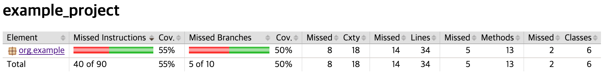

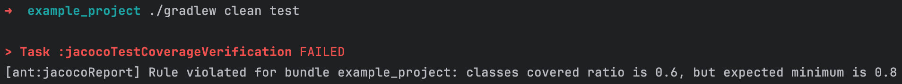

또한 파일 검사 스코프를 클래스 단위로 하고 싶다면 `element`를 `CLASS`로 설정하면 됩니다.

```groovy
// build.gradle

jacocoTestCoverageVerification {
    violationRules {
        rule {
            element = 'CLASS'

            limit {
                minimum = 0.8
            }
        }
    }
}
```

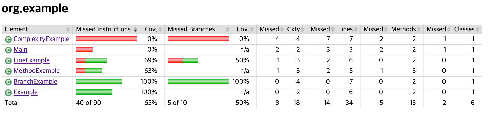

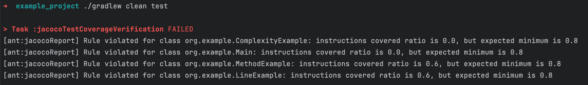

결과를 보면 클래스 단위로 커버리지를 측정하게 되고, 빌드 에러 로그에는 커버리지 결과가 80% 미만인 클래스가 보이네요.

또한 카운터를 명시하지 않았기 때문에 기본값인 `INSTRUCTION` 으로 설정되어 빌드가 실패하게 됩니다.

# 마치며

Java Code Coverage에 대해 알아보았는데, 추가적으로 CI 환경에서도 커버리지를 측정하고, 빌드 실패를 방지하는 방법을 더 공부해볼 예정이에요.

# References

- [JaCoCo](https://www.jacoco.org/jacoco/)
- [Gradle JaCoCo Plugin](https://docs.gradle.org/current/userguide/jacoco_plugin.html)
- [JaCoCo Coverage Verification](https://docs.gradle.org/current/dsl/org.gradle.testing.jacoco.tasks.JacocoCoverageVerification.html)
- [JaCoCo Report](https://docs.gradle.org/current/dsl/org.gradle.testing.jacoco.tasks.JacocoReport.html)
- [JaCoCo Agent](https://www.jacoco.org/jacoco/trunk/doc/agent.html)
- [McCabe Cyclomatic Complexity](http://www.mccabe.com/pdf/mccabe-nist235r.pdf)
- [JaCoCo Coverage Verification Example](https://docs.gradle.org/current/userguide/jacoco_plugin.html#sec:jacoco_coverage_verification)
- [윤범님 블로그](https://velog.io/@uiurihappy/Spring-Jacoco-Sonarcloud-%EB%A1%9C-%EC%BD%94%EB%93%9C-%EB%B6%84%EC%84%9D%ED%95%98%EA%B8%B0)