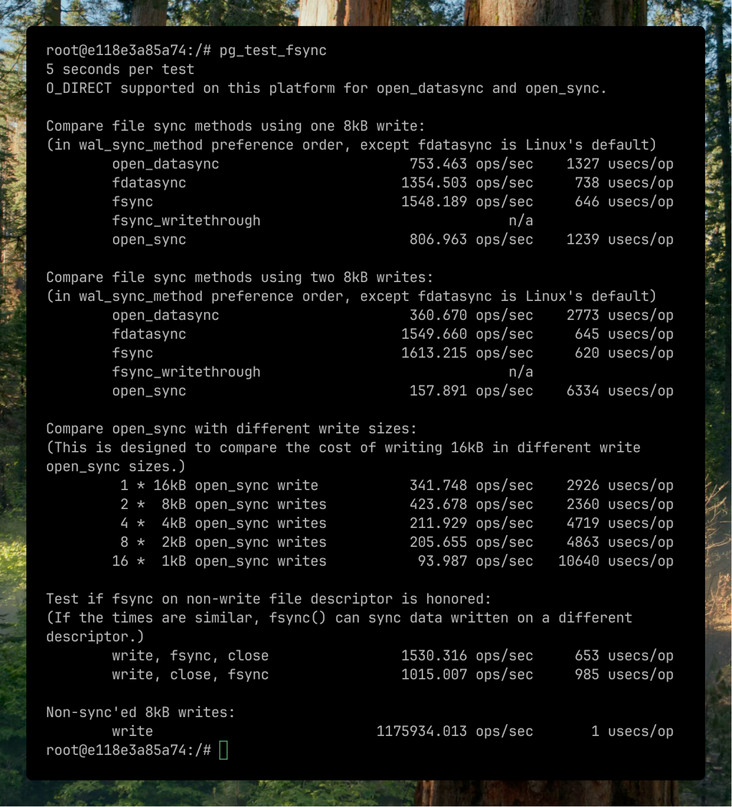

+++
title="[PostgreSQL] Write-Ahead Log (WAL)"
date=2025-03-06 23:00:00
updated=2025-03-06
description="PostgreSQL의 WAL(Write-Ahead Logging) 메커니즘과 관련된 주요 개념 및 설정을 살펴보고, 관련 성능을 최적화하는 방법에 대해 알아보겠습니다."

[taxonomies]
tags=["database", "postgresql", "wal", "write-ahead log"]

[extra]
toc=true
giscus=true
quick_navigation_buttons=true
social_media_card="preview.jpg"
+++

PostgreSQL에서 가장 중요한 점을 꼽으라면 뭐가 있을까요?

저는 데이터의 **신뢰성**과 **무결성**이라고 생각합니다.

백엔드 엔지니어들이 병렬성을 매번 고민하지 않아도 되고, MSA가 유행할 수 있게 된 이유 중 하나가 바로 데이터베이스 자체에서 신뢰성을 보장해주기 때문이라고 생각합니다.

PostgreSQL은 이렇게 신뢰성의 핵심적인 요구사항을 충족하기 위해 Write-Ahead Log(WAL) 를 구현했는데요, 이번에 쓰는 글에서는 WAL의 개념과 작동 방식에 대해 다뤄보겠습니다.

# 1. Write-Ahead Log는 무엇인가?

간단하게 WAL(Write-Ahead Log)은 데이터베이스 시스템 내부에서 쓰는 로그입니다.

모든 변경사항이 실제 데이터 파일에 쓰여지기 전에 먼저 로그에 기록되는 방식이죠.

WAL의 기본 원칙은 다음과 같습니다
> "데이터의 변경을 기록하기 전에, 그 변경사항을 설명하는 로그가 먼저 안전하게 디스크에 저장돼야 한다."

이렇게 간단한 규칙이 PostgreSQL 시스템 내부에서 신뢰성을 구축하는 기반이 됩니다.

# 2. WAL 작동 원리

우선 PostgreSQL에서 WAL이 쓰이는 과정을 단계별로 보면,

1. **변경사항 로깅**
    - 사용자가 데이터를 수정하면 (insert, update, delete 같은...) PostgreSQL은 먼저 이 변경사항을 WAL 버퍼에 기록합니다.
2. **WAL 플러시**
    - 트랜잭션이 커밋될 때, 버퍼에 기록했던 레코드는 디스크에 플러시됩니다.
    - 이 시점에서 변경사항은 실제 DB에 반영되지 않았을 수 있지만, 로그에는 일단 안전하게 저장됩니다.
3. **백그라운드에서 쓰기 작업**
    - 실제 데이터는 이후 백그라운드에서 도는 프로세스에 의해 디스크에 기록됩니다.
    - 이 과정은 뒤에서 설명할 체크포인트라는 이벤트 중에서 대량으로 발생할 수 있습니다.
4. **WAL 세그먼트 매니지**
    - WAL은 일련의 세그먼트 파일로 저장되고 (기본적으로 16MB) 필요에 따라 새로운 세그먼트가 생성됩니다.
    - 오래된 세그먼트는 아카이빙되거나 재사용될 수 있습니다.

# 3. WAL이 제공하는 기능들

PostgreSQL의 WAL 덕분에 할 수 있는 것들이 많습니다.

## 3-1. 장애 복구 (Crash Recovery)

서버가 갑작스럽게 종료되면, PostgreSQL은 재시작 시 WAL을 사용해서 데이터베이스를 복구합니다.

- 마지막 체크포인트로부터 시작해서 WAL Record를 재생(replaying)합니다.
- 따라서 마지막 체크포인트 ~ 충돌 시점까지 트랜잭션을 복구해줍니다.
- 특별한 설정 없이 제공하는 기본적인 옵션입니다.

## 3-2. 특정 시점으로 복구 (Point-in-Time Recovery)

WAL 아카이빙을 활성화하면, 데이터베이스를 과거의 특정 시점으로 돌릴 수 있습니다.

1. 이전 베이스 백업을 복원하고
2. 백업 시점 ~ 원하는 복구 시점까지의 WAL 아카이브를 순차적으로 적용하는 방식입니다.

## 3-3. 복제 (Replication)

WAL은 PostgreSQL의 레플리케이션의 기반이 됩니다.

Replication은 두 가지 방식이 있는데,

1. 물리적 복제
    - Standby 서버는 Primary 서버의 WAL 레코드를 수신하고, 적용해서 동일한 데이터 상태를 유지합니다.
    - 물리적 복제는 기본 옵션이고 데이터의 물리적 변경을 바이트 수준에서 기록합니다.
2. 논리적 복제
    - WAL은 데이터 변경사항을 논리적 형식으로 디코딩해서 선택적인 복제를 가능하게 합니다.
    - 이는 실제 읽을 수 있는 형식으로 변경됩니다.
    ```json
    {
        "action": "UPDATE",
        "table": "users",
        "columns": ["id", "name", "email"],
        "old_values": {"id": 123, "name": "홍길동", "email": "old@example.com"},
        "new_values": {"id": 123, "name": "홍길동", "email": "new@example.com"}
    }
    ```
    - ([Debezium](https://debezium.io/documentation/reference/3.0/connectors/postgresql.html#postgresql-server-configuration) or Qlik Replicate) + Kafka CDC 같은 시스템에서 이런 Logical Replication 구현체를 활용합니다.


# 4. WAL을 구성하는 요소

## 4-1. LSN (Log Sequence Number)

LSN은 WAL 내의 위치를 고유하게 식별하는 64bit 포인터입니다.

LSN은 그냥 단조롭게 증가하는 값이고, WAL 내의 바이트 오프셋을 나타냅니다.

LSN은 pg_current_wal_lsn() 함수로 확인할 수 있습니다.

```sql
select pg_current_wal_lsn()

> 0/1166DB78
```

## 4-2. 체크포인트 (Checkpoint)

체크포인트는 모든 *더티 데이터 페이지가 디스크에 기록되고 특별한 체크포인트 레코드가 WAL에 기록되는 시점입니다.

{{ admonition(type="tip", icon="tip", title="더티 데이터 페이지란?", text="메모리(공유 버퍼)에서 변경되었지만, 아직 디스크에 기록되지 않은 데이터 페이지") }}

- 주기적으로 자동으로 발생 (default: 5분)
    - `checkpoint_timeout` 옵션으로 수정 가능
- 콘솔에서 수동으로 트리거할 수도 있습니다. `checkpoint` 커맨드
- 체크포인트 정보는 WAL에 기록되고, 복구할 떄 시작점으로 사용됩니다
- `max_wal_size`: 체크포인트 간 WAL의 최대 크기. 기본값은 1GB입니다.

체크포인트 관련 옵션인 `checkpoint_timeout`이나 `max_wal_size` 를 줄이면 체크포인트가 더 자주 발생합니다. 
이는 충돌 후 복구 속도가 빨라지긴 하지만, 더티 페이지를 더 자주 플러시해야해서 이런 트레이드오프가 있다 정도만 알면 좋습니다.

### 더티 페이지 플러싱 과정

- 데이터베이스가 운영되는 동안 많은 데이터 페이지가 메모리에서 변경되고 있겠죠? → **더티 상태**
- 체크포인트가 시작되면, PostgreSQL은 모든 더티 페이지를 디스크에 기록합니다.
- 이 과정은 순차적으로 진행되고, `checkpoint_completion_target` 세팅에 따라 시간이 분산됩니다.
    - `checkpoint_completion_target`의 기본값은 0.9입니다.
    - 체크포인트가 시작되면, PostgreSQL은 **더티 페이지 쓰기 작업**을 270초(300초 × 0.9) 동안 분산해서 합니다.
    - → I/O 작업이 짧은 시간에 집중되지 않고 긴 시간에 걸쳐 이븐하게 분포됨을 말합니다.
    - 그리고 다음 체크포인트가 시작되기 약 30초 전에 현재 체크포인트가 완료되도록 I/O 속도를 조절합니다
    ```
    체크포인트1 시작 -------- 체크포인트1 작업(270초) -------- 체크포인트1 완료 -- 휴식기(30초) -- 체크포인트2 시작 ...
    ```
- 모든 더티페이지가 디스크에 기록되면, 메모리와 디스크의 데이터가 일치하는 '일관된 상태'가 됩니다.

### 체크포인트 레코드 기록

- 모든 더티페이지가 디스크에 쓰여진 후에, PostgreSQL은 WAL에 '체크포인트 레코드'를 기록합니다.
- 이 레코드는 데이터베이스가 일관된 상태였던 정확학 시점의 LSN을 표시합니다.
- 체크포인트 레코드에는 이 시점의 상태에 대한 정보가 포함됩니다.

### 체크포인트 기반 복구 시작

- 데이터베이스가 충돌 후 재시작시, 가장 최근의 체크포인트 레코드를 찾습니다.
- 이 체크포인트는 안전함 시작점을 나타냅니다.
    - 이 시점까지는 모든 데이터가 디스크에 제대로 기록된 걸 보장
- 그래서 체크포인트 레코드의 LSN부터 복구를 시작합니다.

# 5. WAL 최적화

## 5-1. WAL 버퍼 늘리기

WAL 버퍼는 공유 메모리의 WAL 데이터를 임시로 저장하는 공간입니다. 

시스템에서 WAL 출력이 많을 경우, WAL 버퍼 수를 늘릴 수 있습니다. (`wal_buffers` 수정하면 됨)

메모리는 디스크보다 훨씬 빠릅니다. WAL 버퍼를 사용하면 DB Task가 디스크에 쓰는 걸 기다리지 않을 수 있죠.

웬만한 사이즈의 프로젝트에서는 기본값인 16MB를 넘기 힘듭니다.

따라서 트랜잭션이 엄청 긴거 아니면 기본값으로 두면 됩니다.


## 5-2. 커밋 지연(Commit Delay)
`commit_delay` 파라메터는 그룹 커밋 리더 프로세스가 `XLogFlush` 내에서 락을 획득한 후 몇 마이크로초 동안 대기할지를 정의합니다. 

예를 들면 PostgreSQL은 각 트랜잭션이 커밋할 때마다 디스크에 즉시 기록합니다 (각 사람이 개인 택시를 타는 것처럼). 

반면 `commit_delay`는 버스가 출발하기 전에 잠시 기다리며 더 많은 승객을 태우는 것과 같습니다.

쉽게 말하면:

- 한 트랜잭션(리더)이 커밋을 요청하면, 바로 디스크에 쓰지 않고 잠시 기다립니다.
- 이 시간 동안 다른 트랜잭션들도 커밋을 할 수 있습니다.
- 대기가 끝나면 모든 내용을 한 번에 디스크에 씁니다.

동시에 많은 트랜잭션이 커밋되는 경우에 좋겠죠? 하지만 너무 길게 잡으면 응답시간이 늘어나서 전체 성능이 떨어질 수도 있습니다.

최적의 세팅 방법은 조금씩 바꾸면서 조정해가면서 제일 괜찮은 값으로 세팅하면 됩니다.

## WAL 동기화 최적화
`wal_sync_method` 파라메터는 PostgreSQL이 커널에 WAL 업데이트를 디스크로 강제 출력하도록 요청하는 방법을 결정합니다. 

쉽게 말해서, PostgreSQL이 "이 데이터를 지금 당장 디스크에 써주세요"라고 운영체제에 요청하는 겁니다.

`wal_sync_method` 은 이런 값들로 설정할 수 있습니다.
- fsync: "이 전체 문서를 서류함에 넣어주세요" (가장 일반적인 방법)
- fdatasync: "문서 내용만 서류함에 넣고, 메타데이터는 나중에 처리해도 됩니다"
- open_sync: "새 문서를 열 때마다 바로 서류함에 넣습니다"
- open_datasync: "새 문서의 내용을 열 때마다 서류함에 넣습니다"
- fsync_writethrough: "서류함뿐만 아니라 금고에도 복사본을 넣어주세요" (가장 안전하지만 가장 느림)

{{ admonition(type="tip", icon="tip", title="왜 이렇게 방식이 많은가요?", text="각 운영체제는 데이터를 디스크에 기록하는 고유한 방법을 가지고 있습니다. 어떤 방법은 리눅스에선 빠르고 윈도우에선 느릴 수 있죠. SSD와 HDD에 따라 최적의 방법이 달라질 수 있구요.") }}

사실 이것도 기본 옵션인 fsync가 대부분의 경우에 좋습니다.

## 어떤 옵션이 최선인지 확인해보기

`pg_test_fsync` 라는 아주 좋은 걸 쓸 수 있습니다. 



→ 역시 fsync가 가장 좋은 것 같죠?


# 6. WAL의 중요성

만약 실수로 중요한 테이블을 삭제했다면 어떻게 복구할 수 있을까요?

테이블 하나때문에 이전 스냅샷을 복원하는 건 너무 데이터 손실이 크죠.

이런 경우에 WAL 아카이빙과 PITR을 사용해서 오류 직전의 상태로 복원이 가능하죠.

# 7. 결론

- 대부분 기본 파라메터로 써도 되지만, 필요에 따라 튜닝이 필요한 경우가 있습니다.
- WAL 원리를 이해하고 있으면 엄청난 트래픽에도 데이터베이스를 효율적으로 운영하는 데 많은 도움이 될 것입니다.

# 8. 출처

- [https://www.postgresql.org/docs/17/wal.html](https://www.postgresql.org/docs/17/wal.html)
