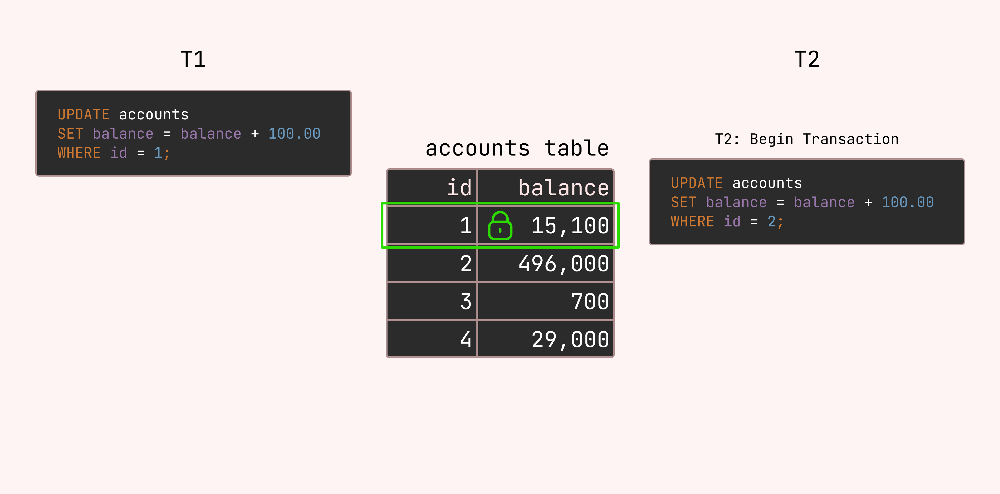

+++
title="[PostgreSQL] PostgreSQL에서의 Lock"
date=2024-06-08 00:49:00
updated=2024-06-08
description="PostgreSQL에서 제공하는 Lock Mode에 대해 알아보고, 어떻게 사용할 수 있는지 알아봅니다."

[taxonomies]
tags=["lock", "postgresql", "database"]

[extra]
giscus = true
quick_navigation_buttons = true
toc = true
+++

# 들어가며


PostgreSQL은 데이터에 대한 **동시 엑세스를 제어**하기 위해 다양한 Lock Mode를 제공합니다.

그리고 우린 이걸 MVCC 스코프 외의 상황에 적절하게 사용할 수 있습니다.

대부분의 PostgresSQL 의 명령어는 실행시 자동으로 적절한 Lock을 획득하여 동작합니다.

예를 들어, `TRUNCATE` 는 동일한 테이블에서 다른 작업과 동시에 안전하게 실행될 수 없으므로 **AccessExclusiveLock** 을 획득합니다.

# Table-Level Locks


테이블 범위로 적용되는 락(잠금)입니다. **[ROW SHARE](#row-share)** 같이 어쩌면 혼동을 줄 수 있는 용어가 있지만 해당 블록에 있는 락은 모두 테이블에 적용되는 Lock입니다.

다음 표에는 여러 Table-Level Lock이 있고, 동시 획득 여부를 나타냈습니다.


하나의 예를 들면 **SHARE UPATE EXCL.** 은 **SHARE UPATE EXCL., SHARE, SHARE ROW EXCL, EXCL., ACCESS EXCL.** 와 충돌하고, **ACCESS SHARE**, **ROW SHARE**, **ROW EXCL.** 와 동시에 획득이 가능합니다.

### ACCESS SHARE


일반적으로 테이블을 **읽기만 하고 수정하지 않는** 모든 쿼리는 참조된 테이블에 대해서 `ACCESS SHARE` Lock을 획득합니다. EX) `SELECT * FROM accounts`


- 해당 락은 **[ACCESS EXCLUSIVE](#access-exclusive)** 와 충돌합니다.

	→ **AccessExclusiveLock** 이 걸려있는게 아니라면 어떤 락이 걸려있어도 무시하고 쿼리를 실행합니다.

### ROW SHARE

- `SELECT` 문을 실행하면 얻습니다.
- 다음 옵션 중 하나를 지정한 테이블에 대해서는 `ROW SHARE` Lock을 획득합니다.
	- `SELECT … FOR UPDATE;`
	- `SELECT … FOR NO KEY UPDATE;`
	- `SELECT … FOR SHARE;`
	- `SELECT … FOR KEY SHARE;`

{{ admonition(type="warning", title="주의할 점", text="ROW 단위로 걸리는 Lock으로 오해할 수 있지만, ROW SHARE Lock이 table에 걸려있다면,  row에 상관없이 **(Access)ExclusiveLock** 가 필요한 작업과 테이블 범위로 충돌이 생깁니다..") }}


```sql
-- T1
BEGIN;
SELECT * FROM accounts WHERE id = 1 FOR UPDATE;  
-- RowShareLock granted
...

-- T2
BEGIN;
alter table public.accounts
    alter column "user" type varchar(128) using "user"::varchar(128);
-- 만약 컬럼 정보를 변경하는 경우 AccessExclusiveLock을 획득해야 합니다.
-- → RowSharedLock과 Conflict! → T1이 끝나야 가능합니다.
```


### ROW EXCLUSIVE


테이블의 **데이터를 수정**하는 모든 명령에 의해 획득됩니다. 

`UPDATE`, `DELETE`, `INSERT`, `MERGE` 명령어가 해당됩니다.

### SHARE UPDATE EXCLUSIVE

- `VACUUM (FULL 제외)`, `ANALYZE`, `CREATE INDEX CONCURRENTLY`, `CREATE SATISTICS`, `COMMENT ON`, `REINDEX CONCURRENTLY`
- 그리고 특정 ALTER INDEX 그리고 ALTER TABLE 등도 포함될 수 있습니다.

### SHARE

- **ShareLock** 은 여러 트랜잭션이 동시에 같은 데이터를 읽을 수 있도록 허용하고, 해당 데이터를 수정하려는 트랜잭션은 제한합니다.
- `CREATE INDEX` 에 의해서 획득됩니다.

만약 데이터가 많은 테이블일 경우 인덱스를 추가하면 어떻게 될까요?

**RowExclusiveLock** 이 필요한 삽입/수정 작업은 인덱스 생성이 끝날 때 까지 대기해야 합니다.


### SHARE ROW EXCLUSIVE

- `CREATE TRIGGER` 그리고 몇몇 `ALTER TABLE` 에 의해서 획득됩니다.

### EXCLUSIVE

- `REFRESH MATERIALIZED VIEW CONCURRENTLY` 에 의해서 획득됩니다.

### ACCESS EXCLUSIVE


가장 강력한 Table-Level Lock 입니다. 테이블 컬럼 수정, 테이블 삭제 같은 **구조 변경**이나, 뷰 갱신 같이 **데이터의 무결성을 보장하기 위해** 사용되고, 어떤 방식으로든 **테이블에 접근하는 유일한 트랜잭션임을 보장**합니다.

**AccessExclusiveLock** 을 일으키는 쿼리는 다음과 같습니다. 


- `DROP TABLE`
- `TRUNCATE`
- `REINDEX`
- `CLUSTER`
- `VACUMM FULL`
- `REFRESH MATERIALIZED VIEW`


{{ admonition(type="tip", title="팁", text="`ACCESS EXCLUSIVE` 만이 `SELECT` 문을 차단합니다. (`FOR UPDATE/SHARE` 제외)") }}

# Row-Level Locks


앞에서 정리한 Table-Level Lock 외에도 Row-Level Lock 이 있습니다.

중요한 개념은 하나의 트랜잭션 (또는 서브트랜잭션) 내에서 같은 행에 대해 서로 충돌하는 Lock을 동시에 획득할 수 있지만, 서로 다른 트랜잭션이 동일한 행의 Lock을 획득하는 것은 불가능합니다.

{{ admonition(type="tip", title="팁", text="Row-Level Lock은 Table-Level Lock과 마찬가지로 트랜잭션 종료 시 또는 롤백 중 해제됩니다.") }}


## FOR UPDATE

> **“나 여기 수정할거니까 아무도 건들지 마”**


트랜잭션이 종료될 때까지 다른 트랜잭션에 의해 변경되는 걸 방지합니다.

그리고 Row-Level에서 충돌이 생긴 다음 작업들은 트랜잭션이 종료될 때까지 기다려야 합니다.


- `UPDATE`
- `DELETE`
- `SELECT FOR UPDATE`
- `SELECT FOR NO KEY`
- `SELECT FOR SHARE`
- `SELECT FOR KEY SHARE`

반대로, 트랜잭션 A가 SELECT ... FOR UPDATE 를 사용해서 특정 행을 읽으려고 하고, 트랜잭션 B가 이미 이 행에 대해서 수정을 시도하고 있다고 가정한다면, 이 작업이 끝날 때 까지 기다려야 합니다.

또한 **REPEATABLE READ** 또는 **SERIALIZABLE** 격리 수준에서는 트랜잭션이 시작된 이후에 변경된 행을 잠그려고 시도할 경우 오류를 발생합니다. 

**FOR UPDATE** 는 DELETE나 UPDATE에 의해서도 획득됩니다. 

```sql
BEGIN;

SELECT * FROM accounts WHERE id = 1 FOR UPDATE;

-- 이 트랜잭션에서는 accounts 테이블의 id가 1인 행을 수정할 수 있습니다.

------

BEGIN;

UPDATE accounts SET balance = balance + 100 WHERE id = 1;  -- Conflict!

-- 하지만 다른 트랜잭션에서 id가 1인 행을 수정하면 충돌이 생길 것입니다.
```


## FOR NO KEY UPDATE


우선 `FOR UPDATE` 보다 약한 Lock이라는 것을 제외하면 거의 비슷합니다.

```sql
SELECT * FROM users WHERE id = 1 FOR UPDATE;
-----------
SELECT * FROM users WHERE id = 1 FOR KEY SHARE;  -- Conflict!
-- or
INSERT INTO accounts (id, balance, user_id) VALUES (5, 1000, 1);  -- Conflict!
```


```sql
SELECT * FROM users WHERE id = 1 FOR NO KEY UPDATE;
-----------
SELECT * FROM users WHERE id = 1 FOR KEY SHARE;  -- Run concurrently
-- or
INSERT INTO accounts (id, balance, user_id) VALUES (5, 1000, 1);  -- Run concurrently
```

{{ admonition(type="tip", title="팁", text="UPDATE 문에서는 `FOR UPDATE`를 따로 명시해주지 않는 이상 `FOR NO KEY UPDATE` 로 동작합니다.") }}

## FOR SHARE


검색된 각 행에 대해 exclusive Lock이 아닌 shared Lock을 획득한다는 점을 제외하면 `FOR NO KEY UPDATE` 와 유사하게 작동합니다.

다른 트랜잭션에서 다음 작업들과 충돌이 생깁니다.


- `UPDATE`
- `DELETE`
- `SELECT FOR UPDATE`
- `SELECT FOR NO KEY UPDATE` 

그리고 다음 작업들은 다른 트랜잭션에서 동시에 실행 가능합니다.


- `SELECT FOR SHARE`
- `SELECT FOR KEY SHARE`

```sql
SELECT * FROM accounts WHERE id = 1;
---
DELETE FROM accounts WHERE id = 1;  -- Run concurrently!
```


```sql
SELECT * FROM accounts WHERE id = 1 FOR SHARE;
---
DELETE FROM accounts WHERE id = 1;  -- Conflict!
```


## FOR KEY SHARE


`FOR SHARE` 와 유사하지만, key가 아닌 컬럼의 변경을 허용한다는 부분이 다릅니다.

→ key를 변경하는 작업을 차단합니다.

```sql
SELECT * FROM accounts WHERE id = 1 FOR KEY SHARE;
---
UPDATE accounts SET "user" = 'gopher' WHERE id = 1;  -- Run concurrently!
UPDATE accounts SET id = 999 WHERE id = 1;  -- Conflict
```

{{ admonition(type="tip", title="팁", text="테이블에 `PRIMARY KEY` 또는 `UNIQUE` 제약 조건이 포함되어 있지 않다면 `FOR SHARE` 를 명시해도 효과가 없을 것입니다.") }}


# Deadlocks


명시적 Lock을 두 개 이상 걸게 되면 교착상태에 빠질 수 있습니다.

예를 들어,


1. 트랜잭션 1 이 테이블 A에 대한 독점 락 (exclusive-lock 이하 “락” 이라고 함) 을 획득한 다음 
2. 테이블 B에 대한 락을 획득하려고 시도하고,
3. 반면, 트랜잭션 2는 이미 테이블 B를 락한 상태에서 
4. 테이블 A에 대한 락을 원한다면 둘 다 진행할 수 없게 됩니다.

교착 상태는 Row-Level Lock 에서도 발생할 수 있습니다.

다음은 예시입니다.


<details>
<summary>gif가 너무 빠르다면</summary>





</details>

교착 상태에 대한 최선의 방어책은 일반적으로 애플리케이션 레벨에서 **일관된 순서로 Lock을 획득하는 것**입니다.

예시에서 두 트랜잭션이 동일한 순서로 행을 업데이트했다면 교착 상태가 발생하지 않았을 것입니다.

또한 필요로 하는 오브젝트에 대해 획득한 Lock이 가장 제한이 많은 (restrictive) 모드인지도 확인하면 좋습니다.

그렇다 해도 개발자가 탐지하지 못하는 교착상태가 있을 수 있는데 이는 적절하게 재시도 로직을 넣어서 오류를 방지하는 것도 좋은 방법입니다.

트랜잭션이 충돌하고, 교착 상태가 감지되지 않는 한 Lock이 해제될 때까지 무한 대기합니다.

따라서 애플리케이션 레벨에서 사용자의 입력을 기다리는 동안 트랜잭션을 열어두는 등의 로직은 피하는 것이 좋습니다.

# Advisory Locks


PostgreSQL에서는 애플리케이션 레벨에서 명시적으로 걸 수 있는 Lock이 존재하는데 이를 *Advisory Lock* 이라고 부릅니다. PostgreSQL 내부 메커니즘과 독립적으로, 사용자가 임의적으로 락을 정의하는 방식입니다.

```sql
SELECT pg_advisory_lock(123);  -- 123 이라는 키로 잠금 획득
-------
SELECT pg_advisory_unlock(123);  -- 해제
```


파이썬으로 작성한다면 다음과 같은 로직으로 구현할 수 있습니다.

```python
from contextlib import contextmanager

@contextmanager
def advisory_lock(lock_id):
    session = Session()
    try:
        session.execute('SELECT pg_advisory_lock(:lock_id)', {'lock_id': lock_id})
        yield session
    finally:
        session.execute('SELECT pg_advisory_unlock(:lock_id)', {'lock_id': lock_id})
        session.close()

def main():
    lock_id = 11223344

    with advisory_lock(lock_id):
        print("Advisory Lock 획득")

        # 락을 걸고싶은 로직 추가...

    print("Advisory Lock 해제")

```

{{ admonition(type="tip", title="팁", text="PostgreSQL의 기존 Lock 시스템과 마찬가지로, 현재 모든 세션이 보유한 Advisory lock 들은 pg_locks을 통해 확인할 수 있습니다.") }}


**주의할 점**

Advisory Lock은 공유 메모리 풀에 저장되며 해당 사이즈는 `max_locks_per_transaction` 및 `max_connections` 에 의해 정의됩니다. 일반적으로 수만 ~ 수십만 개까지 설정됩니다. (소진되지 않게 잘 관리하세요.)

그리고 Advisory lock을 사용할 때 특히 LIMIT을 쓸 때 주의해야 할 점이 있습니다. 예시를 먼저 보시죠.

```sql
SELECT pg_advisory_lock(id)  -- 위험
  FROM accounts 
  WHERE id > 100 
  LIMIT 100;

SELECT pg_advisory_lock(id)  -- 안전
  FROM (
    SELECT id
    FROM accounts
    WHERE id > 100
    LIMIT 100
  ) a;
```


위의 쿼리에서 첫 번째 쿼리는 pg_advisory_lock()이 실행되기 전에 LIMIT이 적용된다는 보장이 없기 때문에 위험합니다. 이것 때문에 예상하지 못한 락이 생겨서 회수되지 않아 무한 대기 상태에 빠질 위험이 있습니다.

# Reference


- [https://www.postgresql.org/docs/16/explicit-locking.html](https://www.postgresql.org/docs/16/explicit-locking.html)

- [https://vladmihalcea.com/postgresql-for-no-key-update/](https://vladmihalcea.com/postgresql-for-no-key-update/)

- [https://chat.openai.com/gpts](https://chat.openai.com/gpts)
